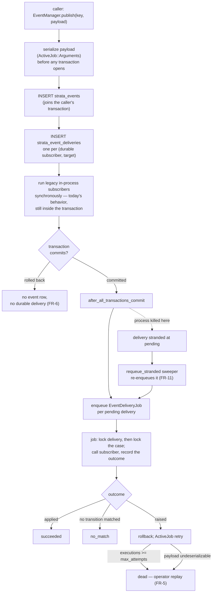

# Design Spec: Durable events

## Status

Draft — for engineering review. Not approved; no implementation has started.

## Date

2026-09-11

## Source intent

[docs/intent/durable-events.md](../../intent/durable-events.md). That document
is the authority on *why*; this one covers *what* and *how*. Where the two
disagree, the intent wins and this spec is wrong.

Decisions carried forward from intent review:

| Question | Answer |
| --- | --- |
| Which loss matters | Crash/deploy mid-handler, and absence of replayable history |
| Handlers may become async | Yes |
| Host-app migration acceptable | Yes |
| Cross-process delivery | Not a goal of the intent — but durable subscribers get it anyway as a consequence of ActiveJob. See [§5.10](#510-cross-process-delivery-is-a-consequence-not-a-feature). |

---

## 1. Summary

`Strata::EventManager.publish` currently hands the event to
`ActiveSupport::Notifications.instrument`, which runs subscribers inline and
forgets the event. This spec makes published events durable: written to a
`strata_events` table inside the publisher's transaction, then dispatched to
subscribers as ActiveJob jobs with at-least-once delivery, retry, and a
queryable delivery record.

The public API (`publish`, `subscribe`, `unsubscribe`, `unsubscribe_all`, and
the `{ name:, payload: }` callback shape) does not change. Every subscriber in
the SDK becomes durable with no call-site edits, because `Strata::BusinessProcess`
already subscribes with `method(:handle_event)` — a named, addressable
reference (`app/models/strata/business_process.rb:114`). Host subscribers
registered as anonymous lambdas cannot be addressed across processes and keep
today's synchronous in-process behavior.

**Four findings in existing code block the intent's goal outright and must be
fixed as part of this work.** They are in [§6](#6-blocking-defects-in-existing-code).
The most serious is that `BusinessProcessInstance#execute_current_step`
swallows every exception, which would make ActiveJob retries silently
ineffective.

---

## 2. Compliance and standards review

Standards this plan was checked against, and where it stands on each:

| Standard | Source consulted | Result |
| --- | --- | --- |
| SDK security precedent | [docs/decisions/audit-log-pii-redaction.md](../../decisions/audit-log-pii-redaction.md) | Read as adjacent precedent, **not** as governing this design. See [§11.2](#112-relationship-to-the-audit-log-pii-decision). |
| Vulnerability handling | [SECURITY.md](../../../SECURITY.md) | Verified. Reporting process only; no engineering controls specified. |
| Authorization | [docs/authorization.md](../../authorization.md), CLAUDE.md ("never bypass authorization policies") | Applied — see [§8.3](#83-access-control). |
| UX / brand | [docs/uswds-components.md](../../uswds-components.md) — USWDS is this SDK's design authority | **Largely not applicable.** See below. |
| Plain language / person-first language | plainlanguage.gov, NYS person-first glossary | No claimant-facing copy is introduced. Requirement recorded for future work in [§8.5](#85-language-standards-for-any-text-this-work-introduces). |
| Data retention and encryption | Owner not yet identified | **Unresolved and blocking.** See [§11.1](#111-retention-and-encryption-requirements-are-unconfirmed). |

**On brand and UX standards.** This change has no user-facing surface. It adds
a database table, a job class, and rake tasks. No claimant sees it; no staff
screen renders it. Rather than manufacture conformance, the honest position is:

- Brand guidelines and USWDS do not bind this change as scoped.
- The operator interface here is deliberately rake tasks plus ActiveRecord
  scopes, matching the existing `lib/tasks/strata_events.rake`.
- An operator console **is explicitly out of scope** ([§9.4](#94-explicitly-out-of-scope)).
  If one is built later it must use `Strata::US::*` ViewComponents per
  [docs/uswds-components.md](../../uswds-components.md), meet USWDS
  accessibility requirements, and sit behind a Pundit policy. That is a
  separate spec.

This review covers the standards documented in this repository. If Nava
maintains brand, UX, or security standards beyond them, this spec has not been
checked against those and should be before implementation starts.

---

## 3. Current behavior

```
publish(key, payload)
  └─> ActiveSupport::Notifications.instrument(key, payload)
        └─> subscriber callbacks, inline, same thread, same process
              └─> BusinessProcess.handle_event
                    └─> Case.for_event(event)
                          └─> BusinessProcessInstance#transition_to_next_step
                                ├─ case.business_process_current_step = next
                                ├─ case.save!            ← state committed
                                └─ execute_current_step  ← work happens after
```

Properties that matter:

- **Nothing is persisted.** The event exists only for the duration of the call.
- **Subscribers are in-process only.** `@@subscriptions` is a class variable on
  `Strata::EventManager` (`app/helpers/strata/event_manager.rb:21`).
- **State is saved before the step executes.** `case.save!` precedes
  `execute_current_step` (`app/models/strata/business_process_instance.rb:63-67`).
- **All exceptions are swallowed** by `execute_current_step`'s
  `rescue Exception` (`app/models/strata/business_process_instance.rb:77`).
- **Events are published from inside transactions.** `ApplicationForm` uses
  `after_create`; `Task` uses `after_update` — not `after_commit`.
- **Payload keys are symbols.** `Case.for_event` tests
  `event[:payload].key?(:case_id)` (`app/models/strata/case.rb:76`).

### Current publishers and subscribers

| Site | Event | Payload |
| --- | --- | --- |
| `ApplicationForm#publish_created` | `<Class>Created` | `{ application_form_id:, submitted_at? }` |
| `ApplicationForm#publish_submitted` | `<Class>Submitted` | same |
| `Task#publish_status_changed_event` | `<Class><Status>` | `{ task_id:, case_id: }` |
| `rake strata:events:publish_event` | arbitrary | none |
| `rake strata:events:publish_case_event` | arbitrary | `{ kase: <AR object> }` |
| `BusinessProcess` (subscriber) | its transition + start events | — |

Note the SDK's own payloads are already identifiers only. That is a useful
property and [§8.1](#81-event-payloads-are-a-new-pii-sink) proposes keeping it.

---

## 4. Requirements

FR-11 and §6.4 were added after review, and several requirements below were
narrowed rather than restated — FR-6 now names its carve-out and NFR-4 now
names a prerequisite. Where a requirement changed, the section it points to
says what the earlier version claimed and why it did not hold.

### Functional

| ID | Requirement |
| --- | --- |
| FR-1 | `publish` durably records the event before returning. If the process is killed immediately after `publish` returns, the event is still delivered. |
| FR-2 | Each durable subscriber receives each event at least once. |
| FR-3 | A delivery that raises is retried with backoff, up to a configured limit, then moved to a terminal `dead` state — never silently dropped. |
| FR-4 | Delivery outcome per (event, subscriber) is queryable: `pending`, `succeeded`, `failed`, `no_match`, `dead`. |
| FR-5 | A `dead` or `failed` delivery can be replayed by an operator without republishing the event. |
| FR-6 | When `publish` is called inside a transaction that later rolls back, no event row survives and no durable delivery happens. Legacy lambda subscribers are explicitly outside this guarantee — see [§5.5](#55-publish-path). |
| FR-7 | A redelivery of an event already applied to a case must not re-apply it (no duplicate task creation, no double step advance). |
| FR-8 | Deliveries for the same case are serialized; two jobs never mutate one case's step concurrently. |
| FR-9 | Payloads containing ActiveRecord objects survive a serialize/deserialize round trip, and symbol keys are preserved so `Case.for_event` keeps matching. |
| FR-10 | Events are prunable by age via a documented, operator-run task. |
| FR-11 | A delivery committed as `pending` whose enqueue was lost is re-enqueued automatically, with no operator action. |

### Non-functional

| ID | Requirement |
| --- | --- |
| NFR-1 | `publish`, `subscribe`, `unsubscribe`, `unsubscribe_all` keep their signatures. The callback still receives `{ name:, payload: }`. |
| NFR-2 | A host that upgrades the gem and runs the migration needs no code changes, with one stated exception: a host publishing a payload ActiveJob cannot serialize must fix that payload. See [§5.3](#53-payload-serialization) and [§10](#10-upgrade-path-for-host-applications). |
| NFR-3 | A host that upgrades but has **not** run the migration keeps working with today's behavior and a clear warning, rather than crashing. |
| NFR-4 | Requires only Postgres and a **durable** ActiveJob backend — Solid Queue, GoodJob, or Sidekiq. No broker. Rails' default `:async` adapter does not satisfy this; see [§5.8](#58-configuration). |
| NFR-5 | Anonymous-lambda subscribers keep working (synchronously, non-durably). |
| NFR-6 | `publish` adds one INSERT plus one enqueue per durable subscriber. No N+1 on the hot path. |
| NFR-7 | Payloads carry identifiers only — no record attributes, no PII. Enforced in code, not merely documented ([§8.1](#81-event-payloads-are-a-new-pii-sink)). |

---

## 5. Design

### 5.1 Architecture



The important property: the event row, the delivery rows, the case's step
change, and the delivery's terminal status are all written transactionally.
Nothing is enqueued until the publisher's transaction commits.

Two things the diagram shows rather than hides, because both were read the
other way in review:

- **Legacy lambda subscribers still run inside the caller's transaction.** That
  is exactly today's behavior, and it is why FR-6 is scoped to durable
  deliveries rather than claimed for everything ([§5.5](#55-publish-path)).
- **The gap between COMMIT and `perform_later` is real.** ActiveJob's retries
  cannot close it — at that instant no job exists to retry. The sweeper in
  [§5.5b](#55b-recovering-stranded-deliveries-fr-11) is what closes it.

### 5.2 Data model

Two tables, shipped as generator templates following the `strata_tasks`
precedent (`lib/generators/strata/task/templates/create_strata_tasks.rb.tt`).
UUID primary keys, matching the rest of the schema.

```ruby
create_table :strata_events, id: :uuid do |t|
  t.string   :name,             null: false, index: true
  t.jsonb    :payload,          null: false, default: {}
  t.string   :publisher_type                    # optional provenance
  t.uuid     :publisher_id
  t.datetime :published_at,     null: false
  t.timestamps
  t.index [ :name, :published_at ]
  t.index :published_at
end

create_table :strata_event_deliveries, id: :uuid do |t|
  t.references :strata_event, null: false, type: :uuid,
               foreign_key: { on_delete: :cascade }   # required by FR-10, see below
  t.string   :subscriber_key,  null: false   # e.g. "PassportBusinessProcess.handle_event"
  t.string   :target_key,      null: false   # delivery identity, never NULL — see below
  t.string   :target_type                     # e.g. "PassportCase"; nil for start events
  t.uuid     :target_id                       # nil for start events
  t.integer  :status,          null: false, default: 0
  t.integer  :attempts,        null: false, default: 0
  t.string   :from_step                       # step at time of application
  t.text     :last_error
  t.datetime :completed_at
  t.timestamps
  t.index [ :strata_event_id, :subscriber_key, :target_key ],
          unique: true, name: "index_strata_event_deliveries_uniqueness"
  t.index [ :status, :created_at ]
end
```

`status` enum: `pending: 0, succeeded: 1, failed: 2, no_match: 3, dead: 4`.

**`on_delete: :cascade` is load-bearing, not tidiness.** Rails' `foreign_key:
true` gives `ON DELETE NO ACTION`. Since `prune` ([§5.9](#59-operator-tooling))
deletes `strata_events` rows that still have delivery rows pointing at them, a
plain FK makes FR-10 raise `ActiveRecord::InvalidForeignKey` the first time it
runs. The cascade is preferred over `dependent: :delete_all` because the prune
task uses `delete_all` and skips callbacks.

**`target_key` exists so delivery identity contains no NULLs.** The obvious
index — `(strata_event_id, subscriber_key, target_type, target_id)` — enforces
nothing for the rows that need it most. Start events and
`rake strata:events:publish_event` resolve no target
([§5.5a](#55a-target-resolution-targets_for)), so `target_type`/`target_id` are
NULL there, and Postgres treats NULLs as distinct in a unique index: two rows
with the same event and subscriber are both accepted, permitting exactly the
duplicate case creation FR-7 is meant to rule out. `target_key` is a NOT NULL
discriminator written by the model — `"PassportCase/<uuid>"` for a resolved
target, the literal string `"start"` for a start event — so every row is
constrained. `target_type`/`target_id` remain as nullable columns backing the
`for_target` scope.

Two alternatives were considered and rejected: `nulls_not_distinct: true`
(correct, but Postgres 15+ only, and the SDK cannot assume a host's Postgres
version), and NOT NULL on `target_id` itself (there is no honest sentinel UUID
for "the case does not exist yet").

**What the index does and does not do.** It prevents duplicate delivery *rows*
at insert time. It does not prevent one row being *executed* twice, which is
the actual at-least-once hazard — a job that succeeds and then loses its ack,
or an operator replay. FR-7 is enforced by the `return if delivery.succeeded?`
check under the row lock in [§5.6](#56-delivery-job-and-idempotency). The index
is a narrower guarantee about row uniqueness; it is not the mechanism behind
FR-7.

**`no_match` is deliberately a distinct state, not a success.** Today, an event
that doesn't match the case's current step returns early and vanishes
(`business_process_instance.rb:60-61`). Recording it makes the single most
common "why didn't my case move?" question answerable. That requires the
handler to be able to *report* a no-op, which it currently cannot — see
[§5.6a](#56a-handler-outcome-contract) and
[§6.4](#64-transition_to_next_step-reports-nothing-to-its-caller).

### 5.3 Payload serialization

Use `ActiveJob::Arguments.serialize` / `.deserialize` rather than raw JSON. This
is the lowest-risk choice available and it solves three problems at once:

1. **Symbol keys survive.** ActiveJob tags hashes with `_aj_symbol_keys`, so
   `event[:payload][:case_id]` still works after a round trip. Raw
   `JSON.parse` would stringify keys and make `Case.for_event` return `none`
   for every event — a silent, total failure (FR-9).
2. **ActiveRecord objects become GlobalIDs.** `{ kase: kase }` from
   `rake strata:events:publish_case_event` serializes to
   `gid://dummy/PassportCase/<uuid>` instead of failing.
3. **It stores a reference, not a snapshot** — which is also a security
   benefit, see [§8.1](#81-event-payloads-are-a-new-pii-sink).

Two consequences engineering must handle explicitly:

- **A replayed event sees current state, not publish-time state.** A GlobalID
  dereferences to the row as it is *now*. For transition events keyed on IDs
  this is correct and desirable. For any payload meant to capture a value at a
  point in time, it is wrong. Document it; do not paper over it.
- **A deleted record makes the payload undeserializable.** `GlobalID::Locator`
  raises `ActiveRecord::RecordNotFound`. Treat this as terminal: mark the
  delivery `dead` with a clear error, do not retry. Retrying cannot help.
  `discard_on` alone does not achieve this — it runs no code and records
  nothing. [§5.6](#56-delivery-job-and-idempotency) uses the block form.

**Serialization runs before any transaction, and it raises.** The payload is
serialized *first*, outside the `ActiveRecord::Base.transaction` block in
[§5.5](#55-publish-path), so a non-serializable payload cannot leave a
half-written event row behind.

It still raises, and that is the deliberate choice — recorded here because it
has a cost that review surfaced and this spec previously understated. `publish`
is called from `after_create`/`after_update`, not `after_commit`, so the raise
propagates out of the model callback and aborts the originating `save!`. A host
that today publishes a payload containing a `Struct`, an IO object, or any
non-GlobalID custom class works fine — `instrument` simply carries it — and
after this change the same publish rejects the record. For
`ApplicationForm#publish_created` that means rejecting a submitted form.

Raising is still the right call: an unserializable payload is a programming
error at the publish site, and recording it as a `dead` delivery would bury a
bug under operator toil while the case never moves. The honest consequence is
that two claims elsewhere had to be corrected rather than defended — NFR-2 now
carries an explicit exception, and [§9.2](#92-phase-2--durable-recording) no
longer calls this step behavior-free. [§10](#10-upgrade-path-for-host-applications)
adds a pre-flight check so a host finds out from a rake task rather than from a
claimant's failed submission.

### 5.4 Durable vs. in-process subscribers

This is the mechanism that satisfies "same public interface" (NFR-1) without
pretending anonymous lambdas can be resurrected in another process.

`subscribe(event_key, callback)` inspects the callback and registers it down
**exactly one** path:

```ruby
# A subscriber is registered durably OR legacily, never both. Registering a
# durable subscriber with ActiveSupport::Notifications as well would run it
# twice for every event — once inline from `legacy_publish`, once from its
# delivery job.
def subscribe(event_key, callback)
  if Strata::Events.durable? && durable_reference?(callback)
    register_durable(event_key, subscriber_key_for(callback))
  else
    warn_not_durably_deliverable(event_key) if Strata::Events.durable?
    legacy_subscribe(event_key, callback)   # today's ActiveSupport::Notifications path
  end
end

# A callback is durably addressable when it is a Method bound to a named
# class or module — the receiver and method name can be rebuilt in any process.
def durable_reference?(callback)
  callback.is_a?(Method) &&
    callback.receiver.is_a?(Module) &&
    callback.receiver.name.present?
end
```

Both branches return a handle that `unsubscribe` accepts, so the public
interface is unchanged (NFR-1):

```ruby
def unsubscribe(subscription)
  case subscription
  when Strata::EventManager::DurableSubscription
    deregister_durable(subscription)
  else
    ActiveSupport::Notifications.unsubscribe(subscription)
  end
end
```

`Strata::BusinessProcess` passes `method(:handle_event)` on a named class, so
**every SDK subscriber is durable automatically with zero call-site changes.**
Host subscribers using lambdas take the legacy branch and behave exactly as
they do today; the warning tells them how to opt in.

Three consequences worth stating explicitly, because each is a way to get this
wrong:

- **`legacy_publish` in §5.5 only reaches non-durable subscribers**, precisely
  because durable ones were never registered with `ActiveSupport::Notifications`.
  It still fires the `instrument` call, so unrelated
  `ActiveSupport::Notifications` listeners (Rails' own, or a host's, registered
  outside `EventManager`) keep working.
- **When `Strata::Events.durable?` is false, every subscriber takes the legacy
  branch**, which is what makes the NFR-3 fallback work: a host that upgrades
  without running the migration gets today's system exactly.
- **The flag is read at subscribe time, not publish time.** It must therefore
  be set before subscriptions register — in practice before the host's
  `config.after_initialize { XBusinessProcess.start_listening_for_events }`
  (see `spec/dummy/config/application.rb:40`). Flipping it at runtime leaves
  already-registered subscribers on whichever path they chose at boot.
  Implementation should raise on a post-registration flip rather than fail
  quietly.

`unsubscribe_all` clears both the durable registry and the notifications
subscriptions, keeping the Zeitwerk reload hook in `lib/strata/engine.rb:52`
correct.

### 5.5 Publish path

```ruby
def publish(event_key, payload = {})
  return legacy_publish(event_key, payload) unless Strata::Events.durable?

  # Outside the transaction on purpose: a non-serializable payload raises here,
  # before any row is written. See 5.3.
  serialized = ActiveJob::Arguments.serialize([ payload ]).first

  event = nil
  ActiveRecord::Base.transaction(requires_new: false) do
    event = Strata::Event.create!(name: event_key, payload: serialized, published_at: Time.current)

    Strata::Events::Router.new(event_key, payload).each_delivery do |d|
      event.deliveries.create!(
        subscriber_key: d[:subscriber_key],
        target_key:     d[:target_key],
        target_type:    d[:target]&.class&.name,
        target_id:      d[:target]&.id
      )
    end
  end

  ActiveRecord.after_all_transactions_commit do
    event.deliveries.pending.find_each { |d| Strata::EventDeliveryJob.perform_later(d.id) }
  end

  # Legacy lambda subscribers. Deliberately still here — inside the caller's
  # transaction, exactly as today. See "On FR-6 and legacy_publish" below.
  legacy_publish(event_key, payload)
  event
end
```

Three things to note:

- **`after_all_transactions_commit`** (Rails 7.2+, satisfied by the gemspec's
  `rails >= 7.2.2.2`) is what fixes the `after_create` hazard flagged in the
  intent. The event row is written in the same transaction as the domain write,
  so a rollback discards both (FR-6), and jobs are enqueued only after the
  outermost commit. If no transaction is open, the block runs immediately.
- **`publish` returns the `Strata::Event`** instead of `nil`. This is additive:
  the previous return value was the `instrument` result, which no caller uses.
  Engineering should confirm that during implementation.
- **Serialization happens before the transaction opens**, so a serialization
  failure writes nothing — though it does still abort the caller's `save!`. See
  [§5.3](#53-payload-serialization).

**On FR-6 and `legacy_publish`.** `legacy_publish` runs where the code above
puts it: after the delivery rows are written, but still *inside* the caller's
open transaction, because `publish` is called from `after_create`/`after_update`
rather than `after_commit`. A lambda subscriber therefore fires for a record
that a later rollback removes. The [§5.1](#51-architecture) diagram previously
showed the opposite — legacy delivery hanging off
`after_all_transactions_commit` — and the diagram has been corrected to match
the code, not the other way round.

This is today's behavior, unchanged, and keeping it is a choice rather than an
oversight. Moving `legacy_publish` into the `after_all_transactions_commit`
block would extend FR-6 to lambdas, but it would break NFR-5's promise that
they behave exactly as they do now — starting with
`spec/support/matchers/publish_event_with_payload.rb:15`, which subscribes a
lambda and asserts synchronously inside the block, and which host apps inherit.
Deferring lambda delivery to after-commit breaks that matcher in every host
using it, to fix a rollback window in a code path that is on its way out.

So FR-6 is scoped to durable deliveries and the carve-out is stated rather than
papered over. `legacy_publish` is a backwards-compatibility shim with a
deprecation path, not a design element:

| Release | `legacy_publish` |
| --- | --- |
| Phase 3 | Supported. A lambda subscriber warns once at `subscribe` time when `durable` is on ([§5.4](#54-durable-vs-in-process-subscribers)). |
| Phase 3 + 1 | That warning becomes a deprecation warning naming the replacement — a `Method` on a named class — and `Strata::Events::TestHelpers` ships so hosts can move off the synchronous matcher. |
| Phase 3 + 2 | `subscribe` raises on a non-durably-addressable callback when `durable` is on; `legacy_publish` is removed. FR-6 then holds for every subscriber, with no carve-out. |

The deprecation is worth committing to in this spec because it is the only path
by which FR-6 ever becomes unconditional.

### 5.5a Target resolution (`targets_for`)

The pseudocode above calls into a router. An earlier draft called
`targets_for(...)` without defining it; review caught that, and the check is
worth recording plainly — `targets_for` appears nowhere else in this spec, and
neither it nor `Strata::Events::Router` exists anywhere in the engine today
(`grep -r targets_for` over the repo returns only the line above). Both are
proposed here for the first time.

That gap matters more than a missing definition normally would, because the
start-event case breaks the obvious implementation. `ApplicationForm#publish_created`
(`after_create`, `app/models/strata/application_form.rb:51,101`) publishes
`<Class>Created`, which is a *start* event (`business_process_builder.rb:57-62`).
Its handler **creates** the case — no case row exists when the event is
published. A router that resolves targets by looking up cases finds none,
writes no delivery row, enqueues no job, and `BusinessProcess.create_case_from_event`
(`business_process.rb:135`) never runs. Under `durable = true` that silently
produces zero cases for every new application: the entire intake path, failing
quietly.

Target resolution therefore has branches, and the start branch is not an edge
case:

```ruby
module Strata::Events
  class Router
    def initialize(event_key, payload)
      @event_key = event_key
      @payload   = payload
    end

    # Yields one hash per delivery row to write.
    def each_delivery
      Strata::EventManager.durable_subscribers_for(@event_key).each do |subscriber_key|
        deliveries_for(subscriber_key).each { |d| yield d.merge(subscriber_key:) }
      end
    end

    private

    def deliveries_for(subscriber_key)
      process = Strata::EventManager.owner_of(subscriber_key)

      # Not a business process. Nothing to resolve; one row.
      return [ { target: nil, target_key: "unrouted" } ] unless process.respond_to?(:start_event?)

      # Start event. The subscriber's job is to CREATE the case, so there is
      # deliberately nothing to resolve. Exactly one row.
      return [ { target: nil, target_key: "start" } ] if process.start_event?(@event_key)

      cases = process.case_class.for_event({ name: @event_key, payload: @payload })

      # No case matched. Still one row, so the no_match is recorded (5.2)
      # instead of the event vanishing as it does today.
      return [ { target: nil, target_key: "unmatched" } ] if cases.empty?

      cases.map { |kase| { target: kase, target_key: "#{kase.class.name}/#{kase.id}" } }
    end
  end
end
```

Note the three distinct `target_key` sentinels. Collapsing them into one string
would make a start delivery and an unmatched delivery collide on the unique
index ([§5.2](#52-data-model)) — a start event and a stray event for the same
key would silently deduplicate into one row.

Three properties worth stating, because each is a way to get this wrong:

- **Targets are resolved at publish time; dispatch happens at delivery time.**
  A case created between the two receives nothing. That is acceptable for
  transition events, which key on a case that already exists, and it is
  precisely why start events resolve no target at all.
- **The router must not assume every durable subscriber owns a `case_class`.**
  The `respond_to?` guard is the whole mechanism; without it, any non-process
  durable subscriber raises inside the publisher's transaction.
- **`Case.for_event` runs twice** — once in the router, once inside
  `handle_event`. Harmless, since it is a scope, but it means the router depends
  on the symbol-key behavior in [§6.3](#63-payload-symbol-keys-are-load-bearing).
  The router sees the *unserialized* payload, so its keys are intact; the job's
  copy comes back through `ActiveJob::Arguments.deserialize`.

### 5.5b Recovering stranded deliveries (FR-11)

`after_all_transactions_commit` runs in the publishing process *after* COMMIT.
A SIGKILL in that window — a deploy, an OOM kill, the exact scenario this work
exists to survive — leaves the event row and its delivery rows committed at
`pending` with no job anywhere.

**ActiveJob's own retries do not cover this, and it is worth being precise
about why.** `retry_on` acts on a job that exists in a queue and raised. In this
window no job was ever enqueued: there is nothing to retry, no failure for the
backend to observe, and no record of intent outside the `pending` row itself.
The delivery sits there indefinitely and the case is stuck exactly as it is
today — except now a row claims the work is pending, which is arguably worse
than no row at all. Without something here FR-1 is unmet, and FR-1 is the whole
point of the work.

This is the standard transactional-outbox gap. Two mechanisms close it:

**A sweeper — recommended, and what this spec assumes.** A periodic job that
re-enqueues deliveries stranded at `pending`:

```ruby
class Strata::RequeueStrandedDeliveriesJob < Strata::ApplicationJob
  def perform(older_than: Strata::Events.stranded_after)
    Strata::EventDelivery.stranded(older_than).find_each do |delivery|
      Strata::EventDeliveryJob.perform_later(delivery.id)
    end
  end
end
```

`stranded_after` defaults to 5 minutes: comfortably longer than a normal
`pending`-to-running transition, short enough that a deploy-time loss is
recovered within one sweep. Re-enqueueing is safe because FR-7's status check
makes a redundant run a no-op. Hosts schedule it with whatever they already use
for recurring work — Solid Queue recurring tasks, GoodJob cron, sidekiq-cron,
or plain `cron` invoking the rake task in [§5.9](#59-operator-tooling). The SDK
ships the job and the task, not the schedule.

**A same-database queue backend — removes the window entirely.** Solid Queue and
GoodJob store jobs in the application's own Postgres, so `perform_later` inside
the publisher's transaction commits atomically with the event row and the
stranded state cannot occur. Strictly better where available, and a further
argument for NFR-4. It cannot be assumed — Sidekiq on Redis cannot do it — so
the sweeper remains the portable mechanism and becomes a cheap backstop rather
than the primary one.

Engineering should decide which is primary per host. The sweeper is not
optional in a design that claims FR-1 across arbitrary durable backends.

### 5.6 Delivery job and idempotency

```ruby
class Strata::EventDeliveryJob < Strata::ApplicationJob
  # :unlimited with the real ceiling enforced in `deliver`, so
  # Strata::Events.max_attempts is read on every attempt rather than frozen
  # at class-definition time. See 5.8.
  retry_on StandardError, wait: :polynomially_longer, attempts: :unlimited

  # Block form. A bare `discard_on` runs no code and records nothing, which
  # would leave the delivery `failed` forever — retried by any operator
  # replaying failures, for the one cause retrying cannot fix. See 5.3.
  discard_on ActiveJob::DeserializationError do |job, error|
    Strata::EventDelivery.find_by(id: job.arguments.first)&.update_columns(
      status: :dead, last_error: "#{error.class}: #{error.message}", completed_at: Time.current
    )
  end

  def perform(delivery_id)
    # find_by, not find: a delivery removed by `prune` while this job sat in
    # the queue is nothing to record and nothing to retry.
    delivery = Strata::EventDelivery.find_by(id: delivery_id)
    return if delivery.nil?

    deliver(delivery)
  end

  private

  # The rescue is scoped to this method, where `delivery` is guaranteed
  # non-nil. Rescuing in `perform` instead would dereference nil whenever the
  # lookup itself raised — a connection error during `find` would surface as
  # NoMethodError and lose the real cause.
  def deliver(delivery)
    delivery.with_lock do
      return if delivery.succeeded?              # FR-7: already applied

      # FR-8: lock the case, not the delivery row. No-op for target-less
      # deliveries ("start", "unmatched", "unrouted").
      delivery.with_locked_target do
        outcome = delivery.resolve_subscriber.call(delivery.event.to_callback_hash)

        delivery.update!(
          status:       Strata::EventDelivery.status_for(outcome),   # 5.6a
          attempts:     executions,
          completed_at: Time.current
        )
      end
    end
  rescue StandardError => e
    give_up = executions >= Strata::Events.max_attempts

    delivery.update_columns(
      status:     give_up ? :dead : :failed,
      attempts:   executions,
      last_error: "#{e.class}: #{e.message}"
    )

    raise unless give_up                         # FR-3: retry, then terminate
  end
end
```

The transaction spans the subscriber call *and* the status write, so the case's
step change and the "this was applied" record commit together or not at all.
This is what closes the gap described in [§6.2](#62-state-is-saved-before-the-step-runs).

**Per-case serialization (FR-8) needs the case lock, not the delivery lock.**
An earlier draft claimed it came from "`Case.lock.find` inside
`BusinessProcessInstance`", which is not true of the code:
`BusinessProcessInstance#initialize(kase, current_step)` receives an
already-loaded case and never locks
(`app/models/strata/business_process_instance.rb:28-30`), and nothing in this
spec added a lock there. The only lock in the original design was on the
delivery row — and two events for one case are two *different* delivery rows,
so two workers would take two different locks, both call
`transition_to_next_step`, and both write `business_process_current_step` on
the same case. That is precisely what FR-8 forbids.

`with_locked_target` is therefore where FR-8 lives:

```ruby
# Strata::EventDelivery
def with_locked_target
  return yield if target_id.blank?

  target_type.constantize.lock.find(target_id)   # FOR UPDATE, held by the
  yield                                          # surrounding transaction
end
```

Two implementation notes:

- **Locking a different Ruby object than the handler uses is fine.** The
  handler re-queries through `Case.for_event` and gets its own instance, but
  the lock is on the database row and is held by the transaction, so a second
  worker blocks at `lock.find` until the first commits. This is also the
  aggregate-root guidance in
  [docs/contributing/data-modeling-guidelines.md](../../contributing/data-modeling-guidelines.md)
  ("routes change through aggregate root" with `lock`).
- **`Strata::Case` carries `default_scope { includes(:tasks) }`**
  (`app/models/strata/case.rb:73`). That resolves to a preload, so `FOR UPDATE`
  applies to the cases query alone and is safe. If a future change turns it
  into an eager load, Postgres rejects `FOR UPDATE` on the nullable side of an
  outer join. Worth a regression test rather than a comment.

### 5.6a Handler outcome contract

As the design originally stood, no code path could assign `no_match`, and
review was right to flag it. The idea was sound; the mechanism was missing.

Trace an `IdentityVerified` event arriving for a case already past that step.
`handle_event` calls `Case.for_event`, which finds the case.
`transition_to_next_step` computes `get_next_step` as nil and **returns early
without raising** (`business_process_instance.rb:60-61`). Control returns
normally to the job, which cannot tell that apart from real work and records
`succeeded`. Every no-op would be indistinguishable from an applied
transition — unmetting FR-4 and silently removing the diagnostic argument made
in [§5.2](#52-data-model), [§5.7](#57-ordering) and
[§11.4](#114-silent-no-ops-become-visible-and-the-numbers-may-be-alarming).

Closing it requires handlers to report an outcome. Two options were weighed:

- **Raise a dedicated `NoMatchingTransition`** for the job to rescue into
  `no_match`. Rejected: a no-op is an expected and common flow, not an error.
  Routing it through exceptions puts it in `retry_on`'s path and in every error
  tracker.
- **Return a value.** Chosen. The handler gains a return value; the callback
  shape it *receives* (`{ name:, payload: }`, NFR-1) is untouched, so this is
  not a public-interface change.

```ruby
# business_process_instance.rb
def transition_to_next_step(event)
  next_step = get_next_step(event[:name])
  return :no_match unless next_step

  self.current_step = next_step
  self.case.save!
  execute_current_step
  :transitioned
end

# business_process.rb — aggregate over the cases the event resolved to
def handle_event(event)
  if start_event?(event[:name])
    kase = create_case_from_event(event)
    kase.business_process_instance.start_from_event(event)
    :transitioned
  else
    outcomes = case_class.for_event(event).map do |kase|
      kase.business_process_instance.transition_to_next_step(event)
    end
    outcomes.include?(:transitioned) ? :transitioned : :no_match
  end
end
```

The job maps that result, treating anything unrecognized as success so a host
subscriber returning its own value is never mislabelled:

```ruby
def self.status_for(outcome)
  outcome == :no_match ? :no_match : :succeeded
end
```

Two consequences to accept deliberately:

- **An empty `for_event` result is `no_match`, not a vacuous success.** That is
  the `"unmatched"` delivery row from
  [§5.5a](#55a-target-resolution-targets_for), and it is the case most worth
  seeing — a payload whose `case_id` matches nothing at all.
- **A host subscriber may return `:no_match`** and get the same reporting for
  free. Document it; do not require it.

### 5.7 Ordering

**Per-case ordering is provided. Global ordering is not.**

"The row lock" here means the **case** row lock from
[§5.6](#56-delivery-job-and-idempotency), not the delivery row lock. That
distinction is the whole of FR-8: two events for one case are two distinct
delivery rows, so delivery-row locks do not serialize them against each other
at all.

With the case lock in place, two events for the same case can still be
*processed* out of publication order if their jobs are picked up out of order —
serialized, but not sequenced. Today's semantics already tolerate this: a
transition is keyed on `(current_step, event_name)`, so an event arriving for
the wrong step is a no-op. Under this design that no-op is recorded as
`no_match` ([§5.6a](#56a-handler-outcome-contract)) rather than vanishing,
which makes the situation diagnosable.

Strict ordering would require a per-case serial queue or a sequence-number
gate with parking. That is a materially larger design and the intent does not
ask for it. Recommend deferring, and revisiting if `no_match` counts in
production show real out-of-order traffic.

### 5.8 Configuration

Following the `mattr_accessor` precedent in
`app/services/strata/task_service.rb`:

```ruby
Strata::Events.durable          = false      # master switch; default off (9.3, 10)
Strata::Events.queue_name       = :strata_events
Strata::Events.max_attempts     = 5          # read at delivery time (5.6)
Strata::Events.stranded_after   = 5.minutes  # sweeper threshold (5.5b)
Strata::Events.retention_period = 90.days    # placeholder — see 11.1
```

Four clarifications. Each of the first three was a contradiction in an earlier
draft rather than a refinement:

- **`durable` defaults to `false`**, agreeing with
  [§9.3](#93-phase-3--durable-delivery) and
  [§10](#10-upgrade-path-for-host-applications). The block above shows
  defaults, not recommendations.
- **`max_attempts` is actually read.** `retry_on StandardError, attempts: 5`
  is evaluated once at class-definition time, so a `max_attempts` setting
  consulted nowhere else is a control operators believe they have and do not.
  That is not cosmetic: a low `max_attempts` is the entire blast-radius
  mitigation offered by
  [§11.3](#113-at-least-once-delivery-can-double-fire-external-side-effects).
  §5.6 uses `attempts: :unlimited` and enforces the real ceiling in its rescue,
  reading the config on every attempt.
- **The missing-tables check happens at boot, not at run time.** NFR-3's
  fallback is: `durable` true with the tables absent warns once and falls back
  to legacy behavior, evaluated at the same moment subscriptions register —
  inside the host's `config.after_initialize`, before boot finishes. It is not
  a runtime flip, which [§5.4](#54-durable-vs-in-process-subscribers) requires
  implementations to raise on. A flag that changed mid-process would leave
  subscribers on whichever path they chose at boot and deliver nothing at all.
- **`durable = true` with a non-durable queue adapter is refused at boot.**
  The adapter is checked against a deny-list — `async`, `inline`, and `test`
  outside the test environment. Rails' default is `:async`, an in-process
  thread pool that discards queued jobs when the process exits, so a host that
  enables durability without configuring a backend gets event rows, delivery
  rows, and no deliveries: durability built on a non-durable queue. `spec/dummy`
  is that host today — `spec/dummy/config/environments/production.rb:73` leaves
  `queue_adapter` commented out and therefore inherits `:async`. Refusing to
  boot is the only honest behavior, and it is what makes NFR-4 enforceable
  rather than aspirational.

### 5.9 Operator tooling

Extends `lib/tasks/strata_events.rake`; no UI.

```
rake strata:events:replay[delivery_id]          # FR-5
rake strata:events:replay_dead[event_name]      # bulk replay
rake strata:events:status[event_id]
rake strata:events:prune[days]                  # FR-10
rake strata:events:requeue_stranded             # FR-11; also scheduled (5.5b)
rake strata:events:check_payloads[event_name]   # pre-flight for 5.3, see 10
```

Backed by scopes on the models, per the data-modeling guideline that queries
live in scopes rather than scattered `where` calls:

```ruby
scope :dead,       -> { where(status: :dead) }
scope :unresolved, -> { where(status: [ :pending, :failed ]) }
scope :stranded,   ->(older_than) { pending.where(created_at: ...older_than.ago) }
scope :stale,      ->(cutoff) { where("created_at < ?", cutoff) }
scope :for_target, ->(record) { where(target_type: record.class.name, target_id: record.id) }
```

**On keeping `dead` as a state distinct from `failed`.** It is fair to ask
whether `failed` plus an attempt count would do. It would not, quite.
`attempts >= max_attempts` re-derives a terminal fact from a mutable setting,
so raising `max_attempts` silently resurrects deliveries an operator has
already triaged as given-up, and a delivery that raised on its final attempt
reads identically to one with a retry still coming. `dead` is what FR-3's
"never silently dropped" and FR-5's replay actually query, it is what keeps
`unresolved` meaningful, and it is the only way to distinguish *this will never
succeed* (a deleted GlobalID) from *this has not succeeded yet*. Now that §5.6
assigns it in both places, the cost of keeping it is two status writes rather
than a state machine.

### 5.10 Cross-process delivery is a consequence, not a feature

The intent lists cross-process delivery as out of scope. That remains true as a
*goal* — this work is not designed to solve it — but the design delivers it
anyway for durable subscribers, and the spec should not pretend otherwise.

`publish` writes a row and enqueues a job. Whichever worker dequeues that job
resolves the subscriber from the stored `subscriber_key` string
(`"PassportBusinessProcess.handle_event"`) by constantizing it. Nothing about
that requires the worker to be the process that published. So a web process
publishing `IdentityVerified` **will** be handled by a worker — which is
exactly the gap the intent described, closed as a side effect of choosing
ActiveJob.

This works because registration is symmetric: hosts call
`start_listening_for_events` from `config.after_initialize`
(`spec/dummy/config/application.rb:40`), which every process runs at boot, so
the publisher and the worker share the same durable registry.

Where the processing location still matters, and it is narrow:

1. **Anonymous lambdas stay in-process.** A closure cannot be serialized or
   rebuilt elsewhere. This is the one part of the cross-process gap this design
   genuinely does not close, and it cannot be closed without changing the
   subscribe API.
2. **The worker must run the same application**, so that `subscriber_key`
   constantizes. A worker booting a subset of the app would resolve nothing.
   Deployment concern, not a design one — but it belongs in the upgrade notes.

No separate intent is needed for the durable case. If cross-process delivery
for lambda subscribers is wanted, that is still its own piece of work.

---

## 6. Blocking defects in existing code

These are not optional cleanups. Each one defeats a requirement above, and each
was found while designing against the current code.

### 6.1 `execute_current_step` swallows every exception

`app/models/strata/business_process_instance.rb:71-82`:

```ruby
rescue Exception => e
  Rails.logger.error "Error executing step ..."
  Rails.logger.error e.backtrace.join("\n")
end
```

**Impact: FR-3 is unachievable as-is.** ActiveJob retries on raised exceptions.
If the step swallows them, every job reports success, every delivery is marked
`succeeded`, and nothing is ever retried — a durable pipeline that durably
records failures as successes. This is worse than today, because it would look
like it was working.

It also rescues `Exception` rather than `StandardError`, absorbing
`SignalException` and `Interrupt` — meaning a step currently resists Ctrl-C and
swallows the very deploy-time termination signal this project exists to
survive.

**Required change:** let exceptions propagate. Log and re-raise. This is
internal, not public API, so it does not violate NFR-1 — but it *is* a
behavior change for hosts whose steps currently raise and are silently
absorbed. Those hosts will start seeing retries and `dead` deliveries where
they previously saw nothing. That is the point, and it must be called out in
the upgrade notes as the loudest item.

**Publishing is not disjoint from the domain write, so this change cannot ship
first.** Review asked for exactly that check and it comes back negative:

- `ApplicationForm` publishes from `after_create`
  (`app/models/strata/application_form.rb:51`), not `after_create_commit`.
- `Task` publishes from `after_update` (`app/models/strata/task.rb:23`), not
  `after_update_commit`.
- `EventManager.publish` calls `ActiveSupport::Notifications.instrument`, which
  runs subscribers inline on the same thread
  (`app/helpers/strata/event_manager.rb:66`).

So `handle_event` → `transition_to_next_step` → `execute_current_step` all run
inside the transaction that is saving the form or the task. An exception that
propagates out of the step unwinds the originating `save!`. The failure mode
changes from *case silently stuck, form saved* to *the claimant's submission is
rejected and the controller 500s* — worse, not merely louder, and it would land
before any retry machinery exists to recover from it.

Moving the publishers to `after_create_commit`/`after_update_commit` would make
them disjoint, but it is the wrong fix: it takes the event row out of the domain
write's transaction, which is the property FR-6 depends on and the whole reason
the outbox row is written inline.

**Sequencing instead.** Propagation is safe once handlers no longer run inside
the publisher's transaction — which is exactly what Phase 3 does by running
them in a job:

- **Phase 1** wraps the step change and its execution in one transaction
  ([§6.2](#62-state-is-saved-before-the-step-runs)), fixes
  [§6.4](#64-transition_to_next_step-reports-nothing-to-its-caller), and
  rescues at the publish boundary. The step transaction rolls back, so the case
  is no longer falsely advanced; the error is logged; the domain write
  survives. Strictly better than today, with no new failure mode.
- **Phase 3** removes the boundary rescue. By then `execute_current_step` runs
  inside `EventDeliveryJob`, where there is no domain write to unwind and a
  raise is precisely what drives the retry.

Worth noting that §6.2 alone accomplishes nothing while exceptions are still
swallowed — the transaction commits the step change either way. The two fixes
are really one change, which is why the boundary rescue is the seam rather than
deferring both to Phase 3.

### 6.2 State is saved before the step runs

`app/models/strata/business_process_instance.rb:63-67` advances
`current_step` and calls `save!` *before* `execute_current_step`.

**Impact: FR-7 and the intent's core goal.** If the process dies between the
save and the execution, the case has advanced but the work never happened. A
retry then calls `transition_to_next_step`, which computes
`get_next_step(event_name)` from the *already-advanced* step, finds no
transition, and returns early — a silent no-op. **The case is permanently
stuck, and retrying cannot rescue it.** Durability alone does not fix this;
without the fix, retries just re-confirm the stuck state.

**Required change:** wrap the step change and its execution in one transaction
(§5.6) so they commit or roll back together.

### 6.3 Payload symbol keys are load-bearing

`Case.for_event` (`app/models/strata/case.rb:76`) tests
`event[:payload].key?(:case_id)`. Any serialization that stringifies keys
makes this return `none` for every event — all deliveries succeed, no case
ever moves. Mitigated by §5.3; flagged here because it is the failure mode
most likely to survive a superficial code review, and it fails *silently*.

### 6.4 `transition_to_next_step` reports nothing to its caller

`app/models/strata/business_process_instance.rb:59-67` returns early, and
returns nothing meaningful, when no transition matches:

```ruby
def transition_to_next_step(event)
  next_step = get_next_step(event[:name])
  return unless next_step
  ...
end
```

**Impact: FR-4 and `no_match`.** The caller cannot distinguish "applied a
transition" from "did nothing", so the delivery job has nothing to record and
files every no-op as `succeeded`. `no_match` becomes unreachable, and with it
the diagnostic value claimed in §5.2, §5.7 and §11.4 — the single most useful
thing this work could add for the people debugging stuck cases.

**Required change:** return `:transitioned` / `:no_match` and aggregate in
`handle_event` — see [§5.6a](#56a-handler-outcome-contract). Small, and it
belongs in Phase 1 alongside §6.2 because it edits the same two methods.

### 6.5 Lower-severity, worth fixing in passing

- `EventManager.publish` logs `payload.inspect` at debug level
  (`app/helpers/strata/event_manager.rb:65`); `BusinessProcess.handle_event`
  and `Case.for_event` do the same. Payloads reach application logs today.
  See [§8.4](#84-log-exposure).
- `@@subscriptions` is a class variable shared across threads
  (`event_manager.rb:21`). Registration happens at boot so contention is
  unlikely, but the durable registry should not repeat the pattern.
- `rake strata:events:publish_case_event` publishes `{ kase: <object> }`, a key
  `Case.for_event` does not recognise — so it returns `none` and drives no
  transition. This task appears to be already ineffective for its apparent
  purpose. Worth confirming with whoever wrote it; out of scope to fix here.
- `Strata::EventManager` lives in `app/helpers/` though it is not a helper.
  Moving it is a breaking constant-path change in spirit; not proposed here.

---

## 7. Test plan

Per [docs/contributing/testing.md](../../contributing/testing.md) — edge cases,
nil handling, error scenarios, data-driven where it fits. Tests are written and
approved **before** implementation, per CLAUDE.md.

### Unit

- `Strata::Event` / `Strata::EventDelivery`: validations, status transitions, scopes.
- Serialization round trip, data-driven across: symbol-keyed hash, nested hash,
  AR object, `nil` payload, empty hash, `Time`/`Date`, oversized payload,
  non-serializable object (must raise a clear error at publish, not at delivery).
- `durable_reference?` across: `method(:x)` on a named class, on an anonymous
  class, a lambda, a proc, a callable object, `nil`.
- `Strata::Events::Router#each_delivery`, data-driven across: a start event, a
  transition event matching one case, matching several, matching none, and a
  durable subscriber that is not a business process. Assert the `target_key`
  each case produces, since that column is the uniqueness invariant.
- `EventDelivery.status_for` across `:transitioned`, `:no_match`, `nil`, and an
  unrecognized value (must be `succeeded`, not `no_match`).

### Integration

- FR-1: publish, kill nothing, assert row + pending delivery exist.
- FR-6: publish inside a rolled-back transaction, assert no event and no enqueue.
- FR-7: run the same delivery job twice, assert one step advance and one task.
- FR-3: subscriber raises, assert retry then `dead` — **this test fails today**
  because of §6.1 and is the regression guard for that fix.
- FR-3 again, via config: set `max_attempts = 2`, assert the delivery is `dead`
  after two executions. Guards the §5.8 fix; fails against a hardcoded
  `attempts: 5`.
- FR-11: commit an event and its deliveries without enqueueing anything (the
  stranded state), run the sweeper, assert delivery. This is the FR-1 test that
  actually exercises the crash window — the existing FR-1 test above does not.
- FR-4 / `no_match`: publish a transition event for a case already past that
  step, assert the delivery is `no_match` and the case did not move. Fails
  against the original design, which recorded `succeeded`.
- Start events: publish `<Class>Created` with `durable = true`, assert exactly
  one delivery row with `target_key` `"start"` **and that the case is created**.
  This is the whole intake path; without the §5.5a rule it silently creates
  nothing.
- Uniqueness: two start-event deliveries for one (event, subscriber) violate
  the unique index. Fails against the original NULL-target index, which
  accepted both.
- §6.2: simulate failure after step change, assert rollback and that a retry
  applies the step correctly.
- §6.1 Phase 1: a step that raises must leave the form or task saved and the
  case not advanced. Asserts the publish-boundary rescue, and is the guard
  against the propagation change landing early.
- FR-8: two concurrent jobs on one case, assert serialized. Assert against the
  *case* lock — a test that only proves two delivery rows were processed
  serially would pass on the original design, which did not satisfy FR-8.
- FR-10: prune an event that still has delivery rows, assert it succeeds.
  Fails without `on_delete: :cascade`.
- A delivery whose event was pruned while its job sat in the queue: assert the
  job returns quietly, and that no `NoMethodError` surfaces in place of the
  real error.
- NFR-3: tables absent → warning, today's behavior, no crash.
- NFR-4: `durable = true` with the `:async` adapter must refuse to boot.
- NFR-5: lambda subscriber still fires synchronously.
- Deleted GlobalID target → `dead`, not an infinite retry, and not `failed`.

### Existing tests that will need to change

- `spec/models/strata/business_process_spec.rb` — publishes then immediately
  asserts state. Needs `perform_enqueued_jobs`.
- `spec/support/matchers/publish_event_with_payload.rb` — subscribes and
  asserts synchronously. Must keep working for both paths; it is the matcher
  host apps inherit, so its behavior is itself a compatibility surface.
- `spec/dummy/spec/business_processes/passport_business_process_spec.rb`.

Ship a `Strata::Events::TestHelpers` module with the change so host apps have a
supported migration path rather than each inventing one.

---

## 8. Security review

### 8.1 Event payloads are a new PII sink

This is the most significant security consequence. Today payloads are transient
and in-memory; after this change they are persisted indefinitely in a jsonb
column — the same shape as `Strata::AuditLine#data`, which has its own decision
record.

Controls proposed:

1. **Identifier-only payloads as a documented rule.** The SDK's own payloads
   already comply (`{ application_form_id: }`, `{ task_id:, case_id: }`). The
   docs must state that event payloads carry identifiers, not attribute values.
2. **GlobalID references, not snapshots** (§5.3). Serializing `{ kase: kase }`
   stores `gid://dummy/PassportCase/<uuid>` — an opaque reference — rather than
   the record's attributes. This is strictly better than the naive
   `to_json` alternative, which would persist every column including PII. Worth
   stating explicitly because it is a real security argument for this design
   choice over the obvious one.
3. **Identifier-only payloads, enforced rather than requested.** A development-
   and test-environment check at publish: every payload value must be a scalar,
   a `GlobalID`-able record, or a collection of those — no attribute hashes, no
   value objects carrying names, addresses or dates of birth. Failing in
   development is what turns NFR-7 from a convention into a requirement. The
   check is deliberately skipped in production, so it can never reject a
   claimant's submission — unlike [§5.3](#53-payload-serialization), where
   raising is correct because the payload genuinely cannot be stored at all.

   An earlier draft instead proposed an optional `Strata::Events.payload_filter`
   and justified it as "Option C from the audit-log ADR, which that ADR judged
   a reasonable defense-in-depth escape hatch". That justification does not
   survive checking the ADR, and the filter has been dropped with it — see
   [§11.2](#112-relationship-to-the-audit-log-pii-decision). Enforcing
   identifier-only payloads is both simpler and a stronger control than
   filtering payloads that should never have carried PII in the first place.
4. **Retention** (FR-10). An unbounded permanent event log is both a privacy and
   a cost liability. `retention_period` defaults to 90 days with a prune task.
   **The 90-day default is a placeholder — see [§11.1](#111-retention-and-encryption-requirements-are-unconfirmed).**

### 8.2 Replay is a privileged operation

Replaying an event re-executes a business process step — it can create tasks,
close cases, or trigger a `SystemProcess` that calls an external system. Replay
is deliberately rake-only (operator with shell access), not exposed via HTTP.
If it is ever exposed, it requires a Pundit policy and an audit entry.

### 8.3 Access control

Nothing in this design is reachable over HTTP, so no policy is required now.
Recorded so the constraint travels with the feature: any future read UI needs a
Pundit policy (CLAUDE.md: "never bypass authorization policies"), and the event
log should be treated as at least as sensitive as the records it references.

### 8.4 Log exposure

`publish` already logs `payload.inspect` at debug level. Persisting payloads
does not create this exposure, but this work is the natural moment to reduce
those lines to the event name and identifiers. Recommended, small, and
independent of the rest.

### 8.5 Language standards for any text this work introduces

No claimant-facing copy is introduced by this spec, so neither the federal
plain-language guidelines nor the person-first glossary bind it directly. If
later work surfaces event state to non-engineers — an operator console, a
status message, a notification — that copy must be checked against both before
it ships. This document uses "people applying for benefits" rather than
"claimants" for the same reason.

---

## 9. Delivery plan

### 9.1 Phase 1 — fix the blockers (no new behavior)

§6.2, §6.4, and the publish-boundary rescue described in
[§6.1](#61-execute_current_step-swallows-every-exception). Ships independently,
improves today's system on its own, and is separately reviewable. **Do this
first**; the rest is unsound without it.

§6.1's full change — letting exceptions propagate past the publish boundary —
is deliberately *not* in this phase. It ships with Phase 3, once handlers run
in a job and a raise can no longer unwind a claimant's submission. Reasoning in
§6.1.

### 9.2 Phase 2 — durable recording

Tables, generator, models, the router ([§5.5a](#55a-target-resolution-targets_for)),
serialization, and `publish` writing rows. Delivery stays synchronous and
in-process. Satisfies the "replayable history" half of the intent, and lets the
payload and serialization work be validated against real traffic before
anything depends on it.

This phase was previously titled "no behavior change" and described as
near-zero risk. That is withdrawn rather than defended: `publish` now
serializes the payload, and a payload ActiveJob cannot serialize raises inside
the caller's `after_create` ([§5.3](#53-payload-serialization)). For the SDK's
own identifier-only payloads the risk genuinely is near zero; for a host
publishing arbitrary objects it is a rejected domain write. That is why
[§10](#10-upgrade-path-for-host-applications) puts
`rake strata:events:check_payloads` *before* this phase rather than after it.

### 9.3 Phase 3 — durable delivery

Job, retries, dead-lettering, idempotency, the FR-11 sweeper
([§5.5b](#55b-recovering-stranded-deliveries-fr-11)), the case lock for FR-8,
and §6.1's exception propagation. `Strata::Events.durable` defaults to **off**;
hosts opt in, and a host without a durable queue backend is refused at boot
([§5.8](#58-configuration)). Flip the default only after a release of field
use.

### 9.4 Explicitly out of scope

- Cross-process delivery for **anonymous lambda** subscribers (§5.10). Durable
  subscribers get cross-process delivery as a consequence of this design; only
  the lambda case remains unsolved.
- Operator web console (own spec; USWDS + Pundit if built).
- Strict global ordering (§5.7).
- Changing which events the SDK publishes, or their payload shapes.
- Retrofitting existing hosts' non-idempotent `SystemProcess` callbacks — see
  §11.3.

---

## 10. Upgrade path for host applications

1. Bump the gem. Nothing changes — `durable` defaults off
   ([§9.3](#93-phase-3--durable-delivery)).
2. Run `rails generate strata:events_migration && rails db:migrate`.
3. Run `rake strata:events:check_payloads` over a representative sample of your
   own publishers. Anything it reports must be fixed before step 7: once
   durability is on, an unserializable payload rejects the record that
   triggered it ([§5.3](#53-payload-serialization)).
4. **Audit `SystemProcess` callbacks for idempotency.** At-least-once delivery
   can call an external system twice — see §11.3. Not optional, and the most
   prominent line in the upgrade notes.
5. Configure a **durable** ActiveJob backend: Solid Queue, GoodJob, or Sidekiq.
   Rails' default `:async` discards queued jobs when the process exits, and
   `durable = true` on a non-durable adapter is refused at boot
   ([§5.8](#58-configuration), NFR-4). Prefer Solid Queue or GoodJob on the
   application's own Postgres — enqueueing then commits together with the event
   row and the FR-11 window closes entirely
   ([§5.5b](#55b-recovering-stranded-deliveries-fr-11)).
6. Schedule `rake strata:events:requeue_stranded` to run every few minutes,
   with whatever already runs your recurring work. Without it, a delivery
   stranded by a deploy is never recovered and FR-1 does not hold.
7. Set `Strata::Events.durable = true` in an initializer — before
   `config.after_initialize { XBusinessProcess.start_listening_for_events }`,
   because the flag is read at subscribe time
   ([§5.4](#54-durable-vs-in-process-subscribers)).
8. Update specs that assume synchronous delivery, using
   `Strata::Events::TestHelpers`.

Skipping step 2 leaves the host on today's behavior with a warning (NFR-3).
Steps 3 through 6 are prerequisites, not follow-ups: each one is a distinct way
for durability to look enabled and deliver nothing.

---

## 11. Areas of concern

### 11.1 Retention and encryption requirements are unconfirmed

**This is the largest open risk in the spec, and it is not a technical one.**

This work creates a permanent store of event payloads where none existed. The
data-policy requirements governing that store have not been confirmed against
Nava policy. The following are therefore **placeholders pending review by
whoever owns data policy**, not settled recommendations:

- The 90-day retention default (§8.1). Benefits programs frequently carry
  multi-year retention obligations that would make 90 days *non-compliant*, and
  a prune task that deletes records someone is legally required to keep is a
  worse outcome than no prune task. Do not ship this default unreviewed.
- Whether persisting event payloads at all requires a privacy review or
  DPIA-equivalent before launch.
- Whether encryption-at-rest for `strata_events.payload` is required. The
  audit-log ADR put encryption explicitly out of scope for `AuditLine#data`;
  whether that extends here is a policy call, not an engineering one.

**Recommended action:** before Phase 2 merges, the owner of Nava's data
retention and privacy policy confirms retention period, encryption-at-rest, and
whether a privacy review is required, and this section is replaced with
citations to those policies.

The identifier-only rule in [§8.1](#81-event-payloads-are-a-new-pii-sink)
narrows this question without answering it. A store of case and task IDs plus
timestamps is still a durable record of who interacted with a benefits program
and when, which is frequently enough to require a retention position of its
own.

### 11.2 Relationship to the audit-log PII decision

[docs/decisions/audit-log-pii-redaction.md](../../decisions/audit-log-pii-redaction.md)
decided **not** to build redaction for `AuditLine#data`, resting on a working
agreement that "engineers calling the API are responsible for self-screening
any value passed to `data:`."

An earlier draft of this spec leaned on that ADR as precedent for the control
it proposed, and got it wrong in two ways that review caught:

1. **It named the wrong option.** The control was described as an "optional
   payload allow-list", which is the ADR's Option **A** — an allow-list DSL on
   the subject model. The mechanism actually sketched, a global `payload_filter`
   hook applied before persistence, is Option **C**, a caller-supplied redactor
   block. The label and the design pointed at different options.
2. **It cited a conclusion the ADR did not reach.** "Judged a reasonable
   defense-in-depth escape hatch" comes from the ADR's *"Hybrid option
   (recommended)"* discussion, which its own Decision section then overrides:
   the team "chose to build none of A/B/C", naming option A as the path only
   *if* the decision is ever revisited. The ADR declined to build any of them.

**The position now taken is that these are separate features, and that ADR does
not govern this one.** The two cases differ in the way that matters: an audit
line has a caller who chooses its contents, so caller discipline is a coherent
control, whereas `ApplicationForm#publish_created` and
`Task#publish_status_changed_event` fire from ActiveRecord callbacks with
payloads composed by the SDK. There is no call site for a host engineer to
screen — they may not know an event was published at all. A control designed
for the first case does not transfer to the second, and borrowing that ADR's
authority to justify one here was the real error, independent of which option
got misquoted.

What replaces it is narrower and needs no precedent: **event payloads carry
identifiers only, and that rule is enforced in development and test rather than
requested in prose** ([§8.1](#81-event-payloads-are-a-new-pii-sink)). Business
process transitions need a `case_id`, a `task_id`, an `application_form_id` and
an event name — nothing about a person. The SDK's own payloads already comply
([§3](#3-current-behavior)). Combined with GlobalID references rather than
attribute snapshots, and idempotent transitions keyed on those identifiers, the
store this work creates holds no PII for a filter to redact, and the tension
this section used to describe does not arise.

**What remains open** is both narrower and properly the team's: whether a
permanent store of identifiers and timestamps is itself enough to warrant a
retention and encryption position
([§11.1](#111-retention-and-encryption-requirements-are-unconfirmed)). That is
a question about this feature, not a reopening of the audit-log ADR. If anyone
later wants payload filtering in the SDK, it should be argued on its own merits
as a change to that ADR — not inherited from it sideways, which is what this
section previously attempted.

### 11.3 At-least-once delivery can double-fire external side effects

**The sharpest new risk this work introduces, and it deserves to block Phase 3
until it is consciously accepted.**

Today a `SystemProcess` callback that raises is swallowed and never retried
(§6.1). After this change it is retried up to `max_attempts`. A callback that
calls an external system — issuing a payment, sending a notice, filing with a
state system — and fails *after* the external call but before commit will make
that call again on retry.

The DB transaction in §5.6 rolls back database state. **It cannot roll back an
HTTP request that already happened.** In a benefits context the concrete
failure is a duplicate payment or a duplicate notice to someone waiting on a
decision.

This is inherent to at-least-once delivery, not a flaw in this design — but it
is a real change in behavior, from "silently never retried" to "retried, maybe
twice." Mitigations:

- Document that `SystemProcess` callbacks must be idempotent. Necessary,
  insufficient on its own.
- Make it the loudest item in the upgrade notes (§10, step 5).
- Default `max_attempts` low (5) so blast radius is bounded — and, per
  [§5.8](#58-configuration), make it a setting the delivery job actually reads,
  so an operator who lowers it gets what they asked for rather than a number
  frozen at class-definition time.
- Consider a per-step `retryable: false` opt-out so hosts can mark a step
  dead-letter-on-first-failure rather than retry it. **Recommended, and not yet
  designed** — flagging rather than hiding it.

### 11.4 Silent no-ops become visible, and the numbers may be alarming

Recording `no_match` (§5.2) will surface events that today vanish. Expect the
first production run to show a non-trivial count. Most will be benign — events
published for cases in a different step. Teams should be warned in advance, or
the first week will read as a regression when it is actually the first honest
measurement.

### 11.5 Making swallowed errors visible changes behavior for existing hosts

Hosts whose steps currently fail silently will start seeing errors. Those
failures are real and already happening — they are simply invisible. Ship the
change with release notes framing it as "errors you already had, now visible,"
and expect support questions.

An earlier draft put this in Phase 1 and described it as purely a visibility
change. That understated it. While handlers run inline inside the publisher's
transaction, a propagating error does not just become visible — it rolls back
the claimant's submission. So the propagation change moved to Phase 3, where
handlers run in a job, and Phase 1 instead gets a publish-boundary rescue that
keeps the domain write while stopping the case from being falsely advanced. The
reasoning, and the check confirming that publishing is *not* disjoint from the
domain write, is in
[§6.1](#61-execute_current_step-swallows-every-exception).

---

## 12. Open questions for the team

1. **Retention** — what is the actual obligation? Blocks the §8.1 default.
2. **Encryption at rest for `payload`** — required for a store of identifiers
   and timestamps, now that §8.1 rules out attribute values?
3. **Sweeper, same-database queue, or both?**
   [§5.5b](#55b-recovering-stranded-deliveries-fr-11) ships the sweeper because
   it is portable across backends, but a host on Solid Queue or GoodJob can
   enqueue inside the publisher's transaction and remove the stranded state
   altogether. Is requiring a same-database backend acceptable, or must Sidekiq
   stay supported?
4. **`retryable: false` per step** (§11.3) — in scope for Phase 3 or deferred?
5. **Should `publish` return the `Strata::Event`?** Additive, but confirm no
   host depends on the current return value.
6. **Default for `Strata::Events.durable`** — off through one release is
   proposed. Is a slower rollout wanted?
7. **Is `rake strata:events:publish_case_event` actually used?** It appears not
   to drive transitions today
   ([§6.5](#65-lower-severity-worth-fixing-in-passing)).
8. **Who owns the `no_match` number?** §11.4 predicts a non-trivial first
   count. Without someone accountable for watching it, it becomes a status
   nobody reads and the diagnostic argument for recording it evaporates.
9. **How long does `legacy_publish` live?** [§5.5](#55-publish-path) proposes
   removing it two releases after Phase 3, which is what finally makes FR-6
   unconditional. Confirm that timeline is acceptable to host teams.

---

## 13. Decision

None yet. This spec is a proposal. Per CLAUDE.md, RSpec tests are written and
approved before any implementation begins, and the phases in §9 are separately
reviewable.
