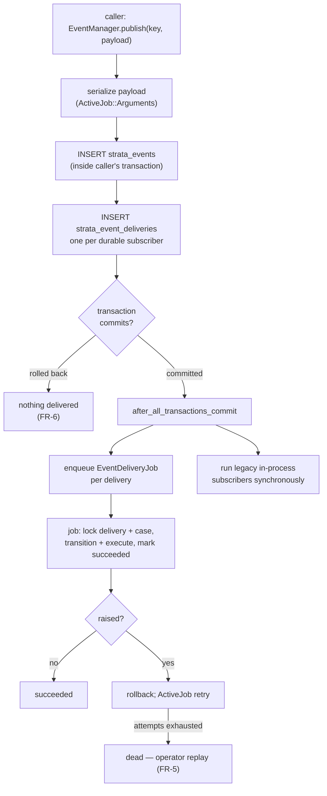

# Design Spec: Durable events

## Status

Draft — for engineering review. Not approved; no implementation has started.

## Date

2026-09-11

## Source intent

[docs/intent/durable-events.md](../../intent/durable-events.md). That document
is the authority on *why*; this one covers *what* and *how*. Where the two
disagree, the intent wins and this spec is wrong.

Decisions carried forward from intent review:

| Question | Answer |
| --- | --- |
| Which loss matters | Crash/deploy mid-handler, and absence of replayable history |
| Handlers may become async | Yes |
| Host-app migration acceptable | Yes |
| Cross-process delivery | Out of scope (separate intent) |

---

## 1. Summary

`Strata::EventManager.publish` currently hands the event to
`ActiveSupport::Notifications.instrument`, which runs subscribers inline and
forgets the event. This spec makes published events durable: written to a
`strata_events` table inside the publisher's transaction, then dispatched to
subscribers as ActiveJob jobs with at-least-once delivery, retry, and a
queryable delivery record.

The public API (`publish`, `subscribe`, `unsubscribe`, `unsubscribe_all`, and
the `{ name:, payload: }` callback shape) does not change. Every subscriber in
the SDK becomes durable with no call-site edits, because `Strata::BusinessProcess`
already subscribes with `method(:handle_event)` — a named, addressable
reference (`app/models/strata/business_process.rb:114`). Host subscribers
registered as anonymous lambdas cannot be addressed across processes and keep
today's synchronous in-process behavior.

**Three findings in existing code block the intent's goal outright and must be
fixed as part of this work.** They are in [§6](#6-blocking-defects-in-existing-code).
The most serious is that `BusinessProcessInstance#execute_current_step`
swallows every exception, which would make ActiveJob retries silently
ineffective.

---

## 2. Compliance and standards review

The request was to conform this plan to brand guidelines, security policies,
and UX standards. Stating plainly what I could and could not verify:

| Standard | Source consulted | Result |
| --- | --- | --- |
| Nava security policy (PII storage, retention, logging) | Sage Bot skill | **Not verified.** No Confluence/Atlassian tooling exists in this session, so Sage could not be searched. Per that skill's own anti-hallucination rule I have not substituted general knowledge. See [§11.1](#111-nava-policy-could-not-be-verified). |
| SDK security precedent | [docs/decisions/audit-log-pii-redaction.md](../../decisions/audit-log-pii-redaction.md) | Verified and applied. Creates a real tension — see [§11.2](#112-policy-tension-caller-discipline-vs-a-framework-written-payload). |
| Vulnerability handling | [SECURITY.md](../../../SECURITY.md) | Verified. Reporting process only; no engineering controls specified. |
| Authorization | [docs/authorization.md](../../authorization.md), CLAUDE.md ("never bypass authorization policies") | Applied — see [§8.3](#83-access-control). |
| UX / brand | [docs/uswds-components.md](../../uswds-components.md) — USWDS is this SDK's design authority | **Largely not applicable.** See below. |
| Plain language / person-first language | Skills unavailable offline (no glossary access) | Not run. Constraint recorded in [§8.5](#85-language-standards-for-any-text-this-work-introduces). |

**On brand and UX standards.** This change has no user-facing surface. It adds
a database table, a job class, and rake tasks. No claimant sees it; no staff
screen renders it. Rather than manufacture conformance, the honest position is:

- Brand guidelines and USWDS do not bind this change as scoped.
- The operator interface here is deliberately rake tasks plus ActiveRecord
  scopes, matching the existing `lib/tasks/strata_events.rake`.
- An operator console **is explicitly out of scope** ([§9.4](#94-explicitly-out-of-scope)).
  If one is built later it must use `Strata::US::*` ViewComponents per
  [docs/uswds-components.md](../../uswds-components.md), meet USWDS
  accessibility requirements, and sit behind a Pundit policy. That is a
  separate spec.

If Nava maintains brand, UX, or security standards beyond the USWDS-derived
ones in this repo, they were not reachable from here and this spec has not been
checked against them.

---

## 3. Current behavior

```
publish(key, payload)
  └─> ActiveSupport::Notifications.instrument(key, payload)
        └─> subscriber callbacks, inline, same thread, same process
              └─> BusinessProcess.handle_event
                    └─> Case.for_event(event)
                          └─> BusinessProcessInstance#transition_to_next_step
                                ├─ case.business_process_current_step = next
                                ├─ case.save!            ← state committed
                                └─ execute_current_step  ← work happens after
```

Properties that matter:

- **Nothing is persisted.** The event exists only for the duration of the call.
- **Subscribers are in-process only.** `@@subscriptions` is a class variable on
  `Strata::EventManager` (`app/helpers/strata/event_manager.rb:21`).
- **State is saved before the step executes.** `case.save!` precedes
  `execute_current_step` (`app/models/strata/business_process_instance.rb:63-67`).
- **All exceptions are swallowed** by `execute_current_step`'s
  `rescue Exception` (`app/models/strata/business_process_instance.rb:77`).
- **Events are published from inside transactions.** `ApplicationForm` uses
  `after_create`; `Task` uses `after_update` — not `after_commit`.
- **Payload keys are symbols.** `Case.for_event` tests
  `event[:payload].key?(:case_id)` (`app/models/strata/case.rb:76`).

### Current publishers and subscribers

| Site | Event | Payload |
| --- | --- | --- |
| `ApplicationForm#publish_created` | `<Class>Created` | `{ application_form_id:, submitted_at? }` |
| `ApplicationForm#publish_submitted` | `<Class>Submitted` | same |
| `Task#publish_status_changed_event` | `<Class><Status>` | `{ task_id:, case_id: }` |
| `rake strata:events:publish_event` | arbitrary | none |
| `rake strata:events:publish_case_event` | arbitrary | `{ kase: <AR object> }` |
| `BusinessProcess` (subscriber) | its transition + start events | — |

Note the SDK's own payloads are already identifiers only. That is a useful
property and [§8.1](#81-event-payloads-are-a-new-pii-sink) proposes keeping it.

---

## 4. Requirements

### Functional

| ID | Requirement |
| --- | --- |
| FR-1 | `publish` durably records the event before returning. If the process is killed immediately after `publish` returns, the event is still delivered. |
| FR-2 | Each durable subscriber receives each event at least once. |
| FR-3 | A delivery that raises is retried with backoff, up to a configured limit, then moved to a terminal `dead` state — never silently dropped. |
| FR-4 | Delivery outcome per (event, subscriber) is queryable: `pending`, `succeeded`, `failed`, `no_match`, `dead`. |
| FR-5 | A `dead` or `failed` delivery can be replayed by an operator without republishing the event. |
| FR-6 | When `publish` is called inside a transaction that later rolls back, the event is not delivered. |
| FR-7 | A redelivery of an event already applied to a case must not re-apply it (no duplicate task creation, no double step advance). |
| FR-8 | Deliveries for the same case are serialized; two jobs never mutate one case's step concurrently. |
| FR-9 | Payloads containing ActiveRecord objects survive a serialize/deserialize round trip, and symbol keys are preserved so `Case.for_event` keeps matching. |
| FR-10 | Events are prunable by age via a documented, operator-run task. |

### Non-functional

| ID | Requirement |
| --- | --- |
| NFR-1 | `publish`, `subscribe`, `unsubscribe`, `unsubscribe_all` keep their signatures. The callback still receives `{ name:, payload: }`. |
| NFR-2 | A host that upgrades the gem and runs the migration needs no code changes. |
| NFR-3 | A host that upgrades but has **not** run the migration keeps working with today's behavior and a clear warning, rather than crashing. |
| NFR-4 | Requires only Postgres and an ActiveJob backend. No broker. |
| NFR-5 | Anonymous-lambda subscribers keep working (synchronously, non-durably). |
| NFR-6 | `publish` adds one INSERT plus one enqueue per durable subscriber. No N+1 on the hot path. |
| NFR-7 | Payloads are serialized without embedding record attributes (identifier references only). |

---

## 5. Design

### 5.1 Architecture



The important property: the event row, the delivery rows, the case's step
change, and the delivery's terminal status are all written transactionally.
Nothing is enqueued until the publisher's transaction commits.

### 5.2 Data model

Two tables, shipped as generator templates following the `strata_tasks`
precedent (`lib/generators/strata/task/templates/create_strata_tasks.rb.tt`).
UUID primary keys, matching the rest of the schema.

```ruby
create_table :strata_events, id: :uuid do |t|
  t.string   :name,             null: false, index: true
  t.jsonb    :payload,          null: false, default: {}
  t.string   :publisher_type                    # optional provenance
  t.uuid     :publisher_id
  t.datetime :published_at,     null: false
  t.timestamps
  t.index [ :name, :published_at ]
  t.index :published_at
end

create_table :strata_event_deliveries, id: :uuid do |t|
  t.references :strata_event, null: false, foreign_key: true, type: :uuid
  t.string   :subscriber_key,  null: false   # e.g. "PassportBusinessProcess.handle_event"
  t.string   :target_type                     # e.g. "PassportCase"
  t.uuid     :target_id
  t.integer  :status,          null: false, default: 0
  t.integer  :attempts,        null: false, default: 0
  t.string   :from_step                       # step at time of application
  t.text     :last_error
  t.datetime :completed_at
  t.timestamps
  t.index [ :strata_event_id, :subscriber_key, :target_type, :target_id ],
          unique: true, name: "index_strata_event_deliveries_uniqueness"
  t.index [ :status, :created_at ]
end
```

`status` enum: `pending: 0, succeeded: 1, failed: 2, no_match: 3, dead: 4`.

The unique index is what makes FR-7 enforceable at the database level rather
than by convention.

**`no_match` is deliberately a distinct state, not a success.** Today, an event
that doesn't match the case's current step returns early and vanishes
(`business_process_instance.rb:60`). Recording it makes the single most common
"why didn't my case move?" question answerable.

### 5.3 Payload serialization

Use `ActiveJob::Arguments.serialize` / `.deserialize` rather than raw JSON. This
is the lowest-risk choice available and it solves three problems at once:

1. **Symbol keys survive.** ActiveJob tags hashes with `_aj_symbol_keys`, so
   `event[:payload][:case_id]` still works after a round trip. Raw
   `JSON.parse` would stringify keys and make `Case.for_event` return `none`
   for every event — a silent, total failure (FR-9).
2. **ActiveRecord objects become GlobalIDs.** `{ kase: kase }` from
   `rake strata:events:publish_case_event` serializes to
   `gid://dummy/PassportCase/<uuid>` instead of failing.
3. **It stores a reference, not a snapshot** — which is also a security
   benefit, see [§8.1](#81-event-payloads-are-a-new-pii-sink).

Two consequences engineering must handle explicitly:

- **A replayed event sees current state, not publish-time state.** A GlobalID
  dereferences to the row as it is *now*. For transition events keyed on IDs
  this is correct and desirable. For any payload meant to capture a value at a
  point in time, it is wrong. Document it; do not paper over it.
- **A deleted record makes the payload undeserializable.** `GlobalID::Locator`
  raises `ActiveRecord::RecordNotFound`. Treat this as terminal: mark the
  delivery `dead` with a clear error, do not retry. Retrying cannot help.

### 5.4 Durable vs. in-process subscribers

This is the mechanism that satisfies "same public interface" (NFR-1) without
pretending anonymous lambdas can be resurrected in another process.

`subscribe(event_key, callback)` inspects the callback:

```ruby
def subscribe(event_key, callback)
  if durable_reference?(callback)
    register_durable(event_key, subscriber_key_for(callback))
  else
    Rails.logger.warn(
      "Strata::EventManager: subscriber for '#{event_key}' is an anonymous " \
      "callable and cannot be delivered durably. It will run in-process only. " \
      "Pass a Method on a named class (e.g. method(:handle_event)) for durable delivery."
    )
  end
  legacy_subscribe(event_key, callback)   # today's ActiveSupport::Notifications path
end

# A callback is durably addressable when it is a Method bound to a named
# class or module — the receiver and method name can be rebuilt in any process.
def durable_reference?(callback)
  callback.is_a?(Method) &&
    callback.receiver.is_a?(Module) &&
    callback.receiver.name.present?
end
```

`Strata::BusinessProcess` passes `method(:handle_event)` on a named class, so
**every SDK subscriber is durable automatically with zero call-site changes.**
Host subscribers using lambdas degrade to today's behavior — which is not a
regression, it is exactly what they have now — and the warning tells them how
to opt in.

`unsubscribe` and `unsubscribe_all` remove both the durable registration and
the notifications subscription. This keeps the Zeitwerk reload hook in
`lib/strata/engine.rb:52` correct.

### 5.5 Publish path

```ruby
def publish(event_key, payload = {})
  return legacy_publish(event_key, payload) unless Strata::Events.durable?

  event = nil
  ActiveRecord::Base.transaction(requires_new: false) do
    event = Strata::Event.create!(
      name: event_key,
      payload: ActiveJob::Arguments.serialize([ payload ]).first,
      published_at: Time.current
    )
    durable_subscribers_for(event_key).each do |subscriber_key|
      targets_for(event_key, subscriber_key, payload).each do |target|
        event.deliveries.create!(subscriber_key:, target_type: target&.class&.name, target_id: target&.id)
      end
    end
  end

  ActiveRecord.after_all_transactions_commit do
    event.deliveries.pending.find_each { |d| Strata::EventDeliveryJob.perform_later(d.id) }
  end

  legacy_publish(event_key, payload)   # anonymous subscribers, unchanged
  event
end
```

Two things to note:

- **`after_all_transactions_commit`** (Rails 7.2+, satisfied by the gemspec's
  `rails >= 7.2.2.2`) is what fixes the `after_create` hazard flagged in the
  intent. The event row is written in the same transaction as the domain write,
  so a rollback discards both (FR-6), and jobs are enqueued only after the
  outermost commit. If no transaction is open, the block runs immediately.
- **`publish` returns the `Strata::Event`** instead of `nil`. This is additive:
  the previous return value was the `instrument` result, which no caller uses.
  Engineering should confirm that during implementation.

### 5.6 Delivery job and idempotency

```ruby
class Strata::EventDeliveryJob < Strata::ApplicationJob
  retry_on StandardError, wait: :polynomially_longer, attempts: 5
  discard_on ActiveJob::DeserializationError   # see 5.3

  def perform(delivery_id)
    delivery = Strata::EventDelivery.find(delivery_id)

    Strata::EventDelivery.transaction do
      delivery.lock!
      return if delivery.succeeded?          # FR-7: already applied

      subscriber = delivery.resolve_subscriber   # "Klass.method" -> Method
      subscriber.call(delivery.event.to_callback_hash)

      delivery.update!(status: :succeeded, completed_at: Time.current)
    end
  rescue StandardError => e
    delivery.update_columns(status: :failed, attempts: delivery.attempts + 1, last_error: e.message)
    raise                                     # let ActiveJob retry (FR-3)
  end
end
```

The transaction spans the subscriber call *and* the status write, so the case's
step change and the "this was applied" record commit together or not at all.
This is what closes the gap described in [§6.2](#62-state-is-saved-before-the-step-runs).

Per-case serialization (FR-8) comes from `Case.lock.find` inside
`BusinessProcessInstance`, which also matches the aggregate-root guidance in
[docs/contributing/data-modeling-guidelines.md](../../contributing/data-modeling-guidelines.md)
("routes change through aggregate root" with `lock`).

### 5.7 Ordering

**Per-case ordering is provided. Global ordering is not.**

The row lock serializes concurrent deliveries for one case, but two events for
the same case can still be *processed* out of publication order if their jobs
are picked up out of order. Today's semantics already tolerate this: a
transition is keyed on `(current_step, event_name)`, so an event arriving for
the wrong step is a no-op. Under this design that no-op is recorded as
`no_match` rather than vanishing, which makes the situation diagnosable.

Strict ordering would require a per-case serial queue or a sequence-number
gate with parking. That is a materially larger design and the intent does not
ask for it. Recommend deferring, and revisiting if `no_match` counts in
production show real out-of-order traffic.

### 5.8 Configuration

Following the `mattr_accessor` precedent in
`app/services/strata/task_service.rb`:

```ruby
Strata::Events.durable         = true   # master switch; false = today's behavior
Strata::Events.queue_name      = :strata_events
Strata::Events.max_attempts    = 5
Strata::Events.retention_period = 90.days
```

`durable` auto-disables with a one-time warning when the tables are absent, so
a host that upgrades the gem before running the migration keeps working
(NFR-3).

### 5.9 Operator tooling

Extends `lib/tasks/strata_events.rake`; no UI.

```
rake strata:events:replay[delivery_id]       # FR-5
rake strata:events:replay_dead[event_name]   # bulk replay
rake strata:events:status[event_id]
rake strata:events:prune[days]               # FR-10
```

Backed by scopes on the models, per the data-modeling guideline that queries
live in scopes rather than scattered `where` calls:

```ruby
scope :dead,      -> { where(status: :dead) }
scope :unresolved,-> { where(status: [ :pending, :failed ]) }
scope :stale,     ->(cutoff) { where("created_at < ?", cutoff) }
scope :for_target,->(record) { where(target_type: record.class.name, target_id: record.id) }
```

---

## 6. Blocking defects in existing code

These are not optional cleanups. Each one defeats a requirement above, and each
was found while designing against the current code.

### 6.1 `execute_current_step` swallows every exception

`app/models/strata/business_process_instance.rb:71-82`:

```ruby
rescue Exception => e
  Rails.logger.error "Error executing step ..."
  Rails.logger.error e.backtrace.join("\n")
end
```

**Impact: FR-3 is unachievable as-is.** ActiveJob retries on raised exceptions.
If the step swallows them, every job reports success, every delivery is marked
`succeeded`, and nothing is ever retried — a durable pipeline that durably
records failures as successes. This is worse than today, because it would look
like it was working.

It also rescues `Exception` rather than `StandardError`, absorbing
`SignalException` and `Interrupt` — meaning a step currently resists Ctrl-C and
swallows the very deploy-time termination signal this project exists to
survive.

**Required change:** let exceptions propagate. Log and re-raise. This is
internal, not public API, so it does not violate NFR-1 — but it *is* a
behavior change for hosts whose steps currently raise and are silently
absorbed. Those hosts will start seeing retries and `dead` deliveries where
they previously saw nothing. That is the point, and it must be called out in
the upgrade notes as the loudest item.

### 6.2 State is saved before the step runs

`app/models/strata/business_process_instance.rb:63-67` advances
`current_step` and calls `save!` *before* `execute_current_step`.

**Impact: FR-7 and the intent's core goal.** If the process dies between the
save and the execution, the case has advanced but the work never happened. A
retry then calls `transition_to_next_step`, which computes
`get_next_step(event_name)` from the *already-advanced* step, finds no
transition, and returns early — a silent no-op. **The case is permanently
stuck, and retrying cannot rescue it.** Durability alone does not fix this;
without the fix, retries just re-confirm the stuck state.

**Required change:** wrap the step change and its execution in one transaction
(§5.6) so they commit or roll back together.

### 6.3 Payload symbol keys are load-bearing

`Case.for_event` (`app/models/strata/case.rb:76`) tests
`event[:payload].key?(:case_id)`. Any serialization that stringifies keys
makes this return `none` for every event — all deliveries succeed, no case
ever moves. Mitigated by §5.3; flagged here because it is the failure mode
most likely to survive a superficial code review, and it fails *silently*.

### 6.4 Lower-severity, worth fixing in passing

- `EventManager.publish` logs `payload.inspect` at debug level
  (`app/helpers/strata/event_manager.rb:65`); `BusinessProcess.handle_event`
  and `Case.for_event` do the same. Payloads reach application logs today.
  See [§8.4](#84-log-exposure).
- `@@subscriptions` is a class variable shared across threads
  (`event_manager.rb:21`). Registration happens at boot so contention is
  unlikely, but the durable registry should not repeat the pattern.
- `rake strata:events:publish_case_event` publishes `{ kase: <object> }`, a key
  `Case.for_event` does not recognise — so it returns `none` and drives no
  transition. This task appears to be already ineffective for its apparent
  purpose. Worth confirming with whoever wrote it; out of scope to fix here.
- `Strata::EventManager` lives in `app/helpers/` though it is not a helper.
  Moving it is a breaking constant-path change in spirit; not proposed here.

---

## 7. Test plan

Per [docs/contributing/testing.md](../../contributing/testing.md) — edge cases,
nil handling, error scenarios, data-driven where it fits. Tests are written and
approved **before** implementation, per CLAUDE.md.

### Unit

- `Strata::Event` / `Strata::EventDelivery`: validations, status transitions, scopes.
- Serialization round trip, data-driven across: symbol-keyed hash, nested hash,
  AR object, `nil` payload, empty hash, `Time`/`Date`, oversized payload,
  non-serializable object (must raise a clear error at publish, not at delivery).
- `durable_reference?` across: `method(:x)` on a named class, on an anonymous
  class, a lambda, a proc, a callable object, `nil`.

### Integration

- FR-1: publish, kill nothing, assert row + pending delivery exist.
- FR-6: publish inside a rolled-back transaction, assert no event and no enqueue.
- FR-7: run the same delivery job twice, assert one step advance and one task.
- FR-3: subscriber raises, assert retry then `dead` — **this test fails today**
  because of §6.1 and is the regression guard for that fix.
- §6.2: simulate failure after step change, assert rollback and that a retry
  applies the step correctly.
- FR-8: two concurrent jobs on one case, assert serialized.
- NFR-3: tables absent → warning, today's behavior, no crash.
- NFR-5: lambda subscriber still fires synchronously.
- Deleted GlobalID target → `dead`, not an infinite retry.

### Existing tests that will need to change

- `spec/models/strata/business_process_spec.rb` — publishes then immediately
  asserts state. Needs `perform_enqueued_jobs`.
- `spec/support/matchers/publish_event_with_payload.rb` — subscribes and
  asserts synchronously. Must keep working for both paths; it is the matcher
  host apps inherit, so its behavior is itself a compatibility surface.
- `spec/dummy/spec/business_processes/passport_business_process_spec.rb`.

Ship a `Strata::Events::TestHelpers` module with the change so host apps have a
supported migration path rather than each inventing one.

---

## 8. Security review

### 8.1 Event payloads are a new PII sink

This is the most significant security consequence. Today payloads are transient
and in-memory; after this change they are persisted indefinitely in a jsonb
column — the same shape as `Strata::AuditLine#data`, which has its own decision
record.

Controls proposed:

1. **Identifier-only payloads as a documented rule.** The SDK's own payloads
   already comply (`{ application_form_id: }`, `{ task_id:, case_id: }`). The
   docs must state that event payloads carry identifiers, not attribute values.
2. **GlobalID references, not snapshots** (§5.3). Serializing `{ kase: kase }`
   stores `gid://dummy/PassportCase/<uuid>` — an opaque reference — rather than
   the record's attributes. This is strictly better than the naive
   `to_json` alternative, which would persist every column including PII. Worth
   stating explicitly because it is a real security argument for this design
   choice over the obvious one.
3. **Optional payload allow-list.** `Strata::Events.payload_filter` applied
   before persistence, defaulting to nil. Cheap, additive, and it is Option C
   from the audit-log ADR, which that ADR judged a reasonable
   defense-in-depth escape hatch.
4. **Retention** (FR-10). An unbounded permanent event log is both a privacy and
   a cost liability. `retention_period` defaults to 90 days with a prune task.
   **The 90-day default is a placeholder — see [§11.1](#111-nava-policy-could-not-be-verified).**

### 8.2 Replay is a privileged operation

Replaying an event re-executes a business process step — it can create tasks,
close cases, or trigger a `SystemProcess` that calls an external system. Replay
is deliberately rake-only (operator with shell access), not exposed via HTTP.
If it is ever exposed, it requires a Pundit policy and an audit entry.

### 8.3 Access control

Nothing in this design is reachable over HTTP, so no policy is required now.
Recorded so the constraint travels with the feature: any future read UI needs a
Pundit policy (CLAUDE.md: "never bypass authorization policies"), and the event
log should be treated as at least as sensitive as the records it references.

### 8.4 Log exposure

`publish` already logs `payload.inspect` at debug level. Persisting payloads
does not create this exposure, but this work is the natural moment to reduce
those lines to the event name and identifiers. Recommended, small, and
independent of the rest.

### 8.5 Language standards for any text this work introduces

The plain-language and person-first-language skills could not run here (no
glossary access). No claimant-facing copy is introduced by this spec. If later
work surfaces event state to non-engineers — an operator console, a status
message, a notification — that copy must go through both checks before it
ships. In this document I have used "people applying for benefits" rather than
"claimants" for that reason.

---

## 9. Delivery plan

### 9.1 Phase 1 — fix the blockers (no new behavior)

§6.1 and §6.2. Ships independently, improves today's system on its own, and is
separately reviewable. **Do this first**; the rest is unsound without it.

### 9.2 Phase 2 — durable recording, no behavior change

Tables, generator, models, serialization, `publish` writes rows. Delivery stays
synchronous and in-process. Satisfies the "replayable history" half of the
intent with near-zero risk, and lets the payload/serialization work be
validated against real traffic before anything depends on it.

### 9.3 Phase 3 — durable delivery

Job, retries, dead-lettering, idempotency, `Strata::Events.durable` defaulting
to **off**. Hosts opt in. Flip the default only after a release of field use.

### 9.4 Explicitly out of scope

- Cross-process delivery (own intent, per intent review).
- Operator web console (own spec; USWDS + Pundit if built).
- Strict global ordering (§5.7).
- Changing which events the SDK publishes, or their payload shapes.
- Retrofitting existing hosts' non-idempotent `SystemProcess` callbacks — see
  §11.3.

---

## 10. Upgrade path for host applications

1. Bump the gem. Nothing changes — `durable` defaults off (Phase 3).
2. Run `rails generate strata:events_migration && rails db:migrate`.
3. Set `Strata::Events.durable = true`.
4. Update specs that assume synchronous delivery, using
   `Strata::Events::TestHelpers`.
5. **Audit `SystemProcess` callbacks for idempotency before enabling in
   production** — see §11.3. This step is not optional and should be the most
   prominent line in the upgrade notes.

Skipping step 2 leaves the host on today's behavior with a warning (NFR-3).

---

## 11. Areas of concern

### 11.1 Nava policy could not be verified

**This is the largest open risk in the spec, and it is not a technical one.**

Sage Bot is the designated route to Nava's policies, and it could not run: this
session has no Confluence tooling. Per that skill's own rule I have not
substituted general knowledge. Consequently the following are **placeholders
pending review by whoever owns data policy**, not recommendations I can stand
behind:

- The 90-day retention default (§8.1). Benefits programs frequently carry
  multi-year retention obligations that would make 90 days *non-compliant*, and
  a prune task that deletes records someone is legally required to keep is a
  worse outcome than no prune task. Do not ship this default unreviewed.
- Whether persisting event payloads at all requires a privacy review or
  DPIA-equivalent before launch.
- Whether encryption-at-rest for `strata_events.payload` is required. The
  audit-log ADR put encryption explicitly out of scope for `AuditLine#data`;
  whether that extends here is a policy call, not an engineering one.

**Recommended action:** before Phase 2 merges, someone with Sage access
confirms retention, encryption, and privacy-review requirements, and this
section is replaced with citations.

### 11.2 Policy tension: caller discipline vs. a framework-written payload

[docs/decisions/audit-log-pii-redaction.md](../../decisions/audit-log-pii-redaction.md)
decided **not** to build redaction for `AuditLine#data`, resting on a working
agreement that "engineers calling the API are responsible for self-screening
any value passed to `data:`."

That reasoning does not transfer cleanly to events, and I cannot satisfy both
the letter of that precedent and the safety goal:

- **Audit lines have a caller.** Someone writes `log.add_line(data: {...})` and
  chooses what goes in. Discipline is a coherent control.
- **Event payloads often have no such caller.** `ApplicationForm#publish_created`
  and `Task#publish_status_changed_event` fire from ActiveRecord callbacks. The
  payload is composed by the SDK. There is no call site for a host engineer to
  screen — they may not know an event was published at all.

Following the precedent exactly means accepting a permanent store whose
contents no one is positioned to screen. Departing from it means this spec
contradicts a decision the team made deliberately four months ago.

**What I have done:** proposed the narrowest departure I can justify — the
identifier-only convention plus an *optional, default-off* filter (§8.1), which
is Option C from that same ADR and which the ADR itself described as a
reasonable defense-in-depth escape hatch. That keeps caller discipline as the
primary control while giving hosts a lever the audit-log design lacks.

**I do not consider this resolved.** The ADR explicitly says the decision is
revisitable "if a host application onboards a higher-sensitivity workload." A
new permanent payload store is arguably that trigger. This needs an explicit
decision from the team, recorded as an update to that ADR or a new one — not a
choice made silently inside this spec.

### 11.3 At-least-once delivery can double-fire external side effects

**The sharpest new risk this work introduces, and it deserves to block Phase 3
until it is consciously accepted.**

Today a `SystemProcess` callback that raises is swallowed and never retried
(§6.1). After this change it is retried up to `max_attempts`. A callback that
calls an external system — issuing a payment, sending a notice, filing with a
state system — and fails *after* the external call but before commit will make
that call again on retry.

The DB transaction in §5.6 rolls back database state. **It cannot roll back an
HTTP request that already happened.** In a benefits context the concrete
failure is a duplicate payment or a duplicate notice to someone waiting on a
decision.

This is inherent to at-least-once delivery, not a flaw in this design — but it
is a real change in behavior, from "silently never retried" to "retried, maybe
twice." Mitigations:

- Document that `SystemProcess` callbacks must be idempotent. Necessary,
  insufficient on its own.
- Make it the loudest item in the upgrade notes (§10, step 5).
- Default `max_attempts` low (5) so blast radius is bounded.
- Consider a per-step `retryable: false` opt-out so hosts can mark a step
  dead-letter-on-first-failure rather than retry it. **Recommended, and not yet
  designed** — flagging rather than hiding it.

### 11.4 Silent no-ops become visible, and the numbers may be alarming

Recording `no_match` (§5.2) will surface events that today vanish. Expect the
first production run to show a non-trivial count. Most will be benign — events
published for cases in a different step. Teams should be warned in advance, or
the first week will read as a regression when it is actually the first honest
measurement.

### 11.5 Phase 1 changes behavior for existing hosts

Making `execute_current_step` raise means hosts whose steps currently fail
silently will start seeing errors. Those failures are real and already
happening — they are simply invisible. Ship Phase 1 with release notes framing
it as "errors you already had, now visible," and expect support questions.

---

## 12. Open questions for the team

1. **Retention** — what is the actual obligation? Blocks the §8.1 default.
2. **Encryption at rest for `payload`** — required, or does the audit-log
   position extend here?
3. **Does §11.2 reopen the audit-log ADR?** If yes, that decision should be
   revisited in its own right rather than as a side effect of this work.
4. **`retryable: false` per step** (§11.3) — in scope for Phase 3 or deferred?
5. **Should `publish` return the `Strata::Event`?** Additive, but confirm no
   host depends on the current return value.
6. **Default for `Strata::Events.durable`** — I propose off through one release.
   Is a slower rollout wanted?
7. **Is `rake strata:events:publish_case_event` actually used?** It appears not
   to drive transitions today (§6.4).

---

## 13. Decision

None yet. This spec is a proposal. Per CLAUDE.md, RSpec tests are written and
approved before any implementation begins, and the phases in §9 are separately
reviewable.
