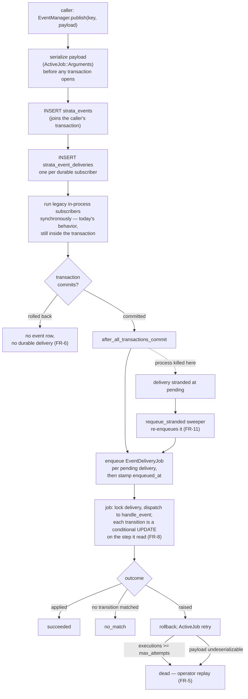

# Design Spec: Durable events

## Status

Draft — for engineering review. Not approved; no implementation has started.

## Date

2026-09-11

## Source intent

[docs/intent/durable-events.md](../../intent/durable-events.md). That document
is the authority on *why*; this one covers *what* and *how*. Where the two
disagree, the intent wins and this spec is wrong.

Decisions carried forward from intent review:

| Question | Answer |
| --- | --- |
| Which loss matters | Crash/deploy mid-handler, and absence of replayable history |
| Handlers may become async | Yes |
| Host-app migration acceptable | Yes |
| Cross-process delivery | Not a goal of the intent — but durable subscribers get it anyway as a consequence of ActiveJob. See [§5.10](#510-cross-process-delivery-is-a-consequence-not-a-feature). |

---

## 1. Summary

`Strata::EventManager.publish` currently hands the event to
`ActiveSupport::Notifications.instrument`, which runs subscribers inline and
forgets the event. This spec makes published events durable: written to a
`strata_events` table inside the publisher's transaction, then dispatched to
subscribers as ActiveJob jobs with at-least-once delivery, retry, and a
queryable delivery record.

The public API (`publish`, `subscribe`, `unsubscribe`, `unsubscribe_all`, and
the `{ name:, payload: }` callback shape) does not change. Every subscriber in
the SDK becomes durable with no call-site edits, because `Strata::BusinessProcess`
already subscribes with `method(:handle_event)` — a named, addressable
reference (`app/models/strata/business_process.rb:114`). Host subscribers
registered as anonymous lambdas cannot be addressed across processes and keep
today's synchronous in-process behavior.

**Four findings in existing code block the intent's goal outright and must be
fixed as part of this work.** They are in [§6](#6-blocking-defects-in-existing-code).
The most serious is that `BusinessProcessInstance#execute_current_step`
swallows every exception, which would make ActiveJob retries silently
ineffective.

---

## 2. Compliance and standards review

Standards this plan was checked against, and where it stands on each:

| Standard | Source consulted | Result |
| --- | --- | --- |
| SDK security precedent | [docs/decisions/audit-log-pii-redaction.md](../../decisions/audit-log-pii-redaction.md) | Read as adjacent precedent, **not** as governing this design. See [§11.2](#112-relationship-to-the-audit-log-pii-decision). |
| Vulnerability handling | [SECURITY.md](../../../SECURITY.md) | Verified. Reporting process only; no engineering controls specified. |
| Authorization | [docs/authorization.md](../../authorization.md), CLAUDE.md ("never bypass authorization policies") | Applied — see [§8.3](#83-access-control). |
| UX / brand | [docs/uswds-components.md](../../uswds-components.md) — USWDS is this SDK's design authority | **Largely not applicable.** See below. |
| Plain language / person-first language | plainlanguage.gov, NYS person-first glossary | No claimant-facing copy is introduced. Requirement recorded for future work in [§8.5](#85-language-standards-for-any-text-this-work-introduces). |
| Data retention and encryption | Owner not yet identified | **Unresolved and blocking.** See [§11.1](#111-retention-and-encryption-requirements-are-unconfirmed). |

**On brand and UX standards.** This change has no user-facing surface. It adds
a database table, a job class, and rake tasks. No claimant sees it; no staff
screen renders it. Rather than manufacture conformance, the honest position is:

- Brand guidelines and USWDS do not bind this change as scoped.
- The operator interface here is deliberately rake tasks plus ActiveRecord
  scopes, matching the existing `lib/tasks/strata_events.rake`.
- An operator console **is explicitly out of scope** ([§9.4](#94-explicitly-out-of-scope)).
  If one is built later it must use `Strata::US::*` ViewComponents per
  [docs/uswds-components.md](../../uswds-components.md), meet USWDS
  accessibility requirements, and sit behind a Pundit policy. That is a
  separate spec.

This review covers the standards documented in this repository. If Nava
maintains brand, UX, or security standards beyond them, this spec has not been
checked against those and should be before implementation starts.

---

## 3. Current behavior

```
publish(key, payload)
  └─> ActiveSupport::Notifications.instrument(key, payload)
        └─> subscriber callbacks, inline, same thread, same process
              └─> BusinessProcess.handle_event
                    └─> Case.for_event(event)
                          └─> BusinessProcessInstance#transition_to_next_step
                                ├─ case.business_process_current_step = next
                                ├─ case.save!            ← state committed
                                └─ execute_current_step  ← work happens after
```

Properties that matter:

- **Nothing is persisted.** The event exists only for the duration of the call.
- **Subscribers are in-process only.** `@@subscriptions` is a class variable on
  `Strata::EventManager` (`app/helpers/strata/event_manager.rb:21`).
- **State is saved before the step executes.** `case.save!` precedes
  `execute_current_step` (`app/models/strata/business_process_instance.rb:63-67`).
- **All exceptions are swallowed** by `execute_current_step`'s
  `rescue Exception` (`app/models/strata/business_process_instance.rb:77`).
- **Events are published from inside transactions.** `ApplicationForm` uses
  `after_create`; `Task` uses `after_update` — not `after_commit`.
- **Payload keys are symbols.** `Case.for_event` tests
  `event[:payload].key?(:case_id)` (`app/models/strata/case.rb:76`).

### Current publishers and subscribers

| Site | Event | Payload |
| --- | --- | --- |
| `ApplicationForm#publish_created` | `<Class>Created` | `{ application_form_id:, submitted_at? }` |
| `ApplicationForm#publish_submitted` | `<Class>Submitted` | same |
| `Task#publish_status_changed_event` | `<Class><Status>` | `{ task_id:, case_id: }` |
| `rake strata:events:publish_event` | arbitrary | none |
| `rake strata:events:publish_case_event` | arbitrary | `{ kase: <AR object> }` |
| `BusinessProcess` (subscriber) | its transition + start events | — |

Note the SDK's own payloads are already identifiers only. That is a useful
property and [§8.1](#81-event-payloads-are-a-new-pii-sink) proposes keeping it.

---

## 4. Requirements

FR-11 and §6.4 were added after review, and FR-7, FR-8 and FR-11 were then
narrowed again in a third round. Several requirements below were narrowed
rather than restated — FR-6 now names its carve-out and NFR-4 now
names a prerequisite. Where a requirement changed, the section it points to
says what the earlier version claimed and why it did not hold.

### Functional

| ID | Requirement |
| --- | --- |
| FR-1 | `publish` durably records the event before returning. If the process is killed immediately after `publish` returns, the event is still delivered. |
| FR-2 | Each durable subscriber receives each event at least once. |
| FR-3 | A delivery that raises is retried with backoff, up to a configured limit, then moved to a terminal `dead` state — never silently dropped. |
| FR-4 | Delivery outcome per (event, subscriber) is queryable: `pending`, `succeeded`, `failed`, `no_match`, `dead`. |
| FR-5 | A `dead` or `failed` delivery can be replayed by an operator without republishing the event. |
| FR-6 | When `publish` is called inside a transaction that later rolls back, no event row survives and no durable delivery happens. Legacy lambda subscribers are explicitly outside this guarantee — see [§5.5](#55-publish-path). |
| FR-7 | A redelivery of an event already applied must not re-apply it (no duplicate task creation, no double step advance). Enforced per (event, subscriber) by the status check in [§5.6](#56-delivery-job-and-idempotency), and per case by the conditional transition in the same section. |
| FR-8 | Two jobs never both advance one case's step. Served by a conditional UPDATE on the step the handler read, plus a queue concurrency key where the backend provides one — see [§5.6](#56-delivery-job-and-idempotency). |
| FR-9 | Payloads containing ActiveRecord objects survive a serialize/deserialize round trip, and symbol keys are preserved so `Case.for_event` keeps matching. |
| FR-10 | Events are prunable by age via a documented, operator-run task. |
| FR-11 | A delivery committed as `pending` whose enqueue was **lost** is re-enqueued automatically, with no operator action. Distinguished from a merely slow queue by `enqueued_at` ([§5.5b](#55b-recovering-stranded-deliveries-fr-11)). |

### Non-functional

| ID | Requirement |
| --- | --- |
| NFR-1 | `publish`, `subscribe`, `unsubscribe`, `unsubscribe_all` keep their signatures. The callback still receives `{ name:, payload: }`. |
| NFR-2 | A host that upgrades the gem and runs the migration needs no code changes, with one stated exception: a host publishing a payload ActiveJob cannot serialize must fix that payload. See [§5.3](#53-payload-serialization) and [§10](#10-upgrade-path-for-host-applications). |
| NFR-3 | A host that upgrades but has **not** run the migration keeps working with today's behavior and a clear warning, rather than crashing. |
| NFR-4 | Requires only Postgres and a **durable** ActiveJob backend — Solid Queue, GoodJob, or Sidekiq. No broker. Rails' default `:async` adapter does not satisfy this; see [§5.8](#58-configuration). |
| NFR-5 | Anonymous-lambda subscribers keep working (synchronously, non-durably). |
| NFR-6 | `publish` adds one INSERT plus one enqueue per durable subscriber. No N+1 on the hot path. |
| NFR-7 | Payloads carry identifiers only — no record attributes, no PII. Enforced in code, not merely documented ([§8.1](#81-event-payloads-are-a-new-pii-sink)). |

---

## 5. Design

### 5.1 Architecture



The important property: the event row, the delivery rows, the case's step
change, and the delivery's terminal status are all written transactionally.
Nothing is enqueued until the publisher's transaction commits.

Two things the diagram shows rather than hides, because both were read the
other way in review:

- **Legacy lambda subscribers still run inside the caller's transaction.** That
  is exactly today's behavior, and it is why FR-6 is scoped to durable
  deliveries rather than claimed for everything ([§5.5](#55-publish-path)).
- **The gap between COMMIT and `perform_later` is real.** ActiveJob's retries
  cannot close it — at that instant no job exists to retry. The sweeper in
  [§5.5b](#55b-recovering-stranded-deliveries-fr-11) is what closes it.

### 5.2 Data model

Two tables, shipped as generator templates following the `strata_tasks`
precedent (`lib/generators/strata/task/templates/create_strata_tasks.rb.tt`).
UUID primary keys, matching the rest of the schema.

```ruby
create_table :strata_events, id: :uuid do |t|
  t.string   :name,             null: false, index: true
  t.jsonb    :payload,          null: false, default: {}
  t.string   :publisher_type                    # optional provenance
  t.uuid     :publisher_id
  t.datetime :published_at,     null: false
  t.timestamps
  t.index [ :name, :published_at ]
  t.index :published_at
end

create_table :strata_event_deliveries, id: :uuid do |t|
  t.references :strata_event, null: false, type: :uuid,
               foreign_key: { on_delete: :cascade }   # required by FR-10, see below
  t.string   :subscriber_key,  null: false   # e.g. "PassportBusinessProcess.handle_event"
  t.integer  :status,          null: false, default: 0
  t.integer  :attempts,        null: false, default: 0
  t.datetime :enqueued_at                     # nil until perform_later returned — see 5.5b
  t.text     :last_error
  t.datetime :completed_at
  t.timestamps
  t.index [ :strata_event_id, :subscriber_key ],
          unique: true, name: "index_strata_event_deliveries_uniqueness"
  t.index [ :status, :enqueued_at ]           # the FR-11 sweeper's query
  t.index [ :status, :created_at ]
end
```

`status` enum: `pending: 0, succeeded: 1, failed: 2, no_match: 3, dead: 4`.

**`on_delete: :cascade` is load-bearing, not tidiness.** Rails' `foreign_key:
true` gives `ON DELETE NO ACTION`. Since `prune` ([§5.9](#59-operator-tooling))
deletes `strata_events` rows that still have delivery rows pointing at them, a
plain FK makes FR-10 raise `ActiveRecord::InvalidForeignKey` the first time it
runs. The cascade is preferred over `dependent: :delete_all` because the prune
task uses `delete_all` and skips callbacks.

**Delivery identity is `(event, subscriber)`, and that is deliberately all it
is.** An earlier draft resolved target cases at publish time and wrote one row
per (subscriber, case), which forced three further columns —
`target_key`, `target_type`, `target_id` — and a NOT NULL sentinel vocabulary
(`"start"`, `"unmatched"`, `"unrouted"`) so the unique index would still
constrain rows that resolved no target. All of that is gone with the
resolution; see [§5.5a](#55a-why-targets-are-not-resolved-at-publish-time) for
why, and what it removed.

With one row per subscriber there are no NULLs in the identity, so no
discriminator is needed, `nulls_not_distinct: true` is not needed either (it is
Postgres 15+ only and the SDK cannot assume a host's version), and the question
of an honest sentinel UUID for "the case does not exist yet" does not arise.

`from_step` is gone for the same reason: one delivery now covers however many
cases the event resolves to, so a single step-at-time-of-application column has
no coherent value to hold.

**What the index does and does not do.** It prevents duplicate delivery *rows*
at insert time. It does not prevent one row being *executed* twice, which is
the actual at-least-once hazard — a job that succeeds and then loses its ack,
or an operator replay. FR-7 is enforced by the `return if delivery.succeeded?`
check under the row lock in [§5.6](#56-delivery-job-and-idempotency). The index
is a narrower guarantee about row uniqueness; it is not the mechanism behind
FR-7.

**`no_match` is deliberately a distinct state, not a success.** Today, an event
that doesn't match the case's current step returns early and vanishes
(`business_process_instance.rb:60-61`). Recording it makes the single most
common "why didn't my case move?" question answerable. That requires the
handler to be able to *report* a no-op, which it currently cannot — see
[§5.6a](#56a-handler-outcome-contract) and
[§6.4](#64-transition_to_next_step-reports-nothing-to-its-caller).

### 5.3 Payload serialization

Use `ActiveJob::Arguments.serialize` / `.deserialize` rather than raw JSON. This
is the lowest-risk choice available and it solves three problems at once:

1. **Symbol keys survive.** ActiveJob tags hashes with `_aj_symbol_keys`, so
   `event[:payload][:case_id]` still works after a round trip. Raw
   `JSON.parse` would stringify keys and make `Case.for_event` return `none`
   for every event — a silent, total failure (FR-9).
2. **ActiveRecord objects become GlobalIDs.** `{ kase: kase }` from
   `rake strata:events:publish_case_event` serializes to
   `gid://dummy/PassportCase/<uuid>` instead of failing.
3. **It stores a reference, not a snapshot** — which is also a security
   benefit, see [§8.1](#81-event-payloads-are-a-new-pii-sink).

Two consequences engineering must handle explicitly:

- **A replayed event sees current state, not publish-time state.** A GlobalID
  dereferences to the row as it is *now*. For transition events keyed on IDs
  this is correct and desirable. For any payload meant to capture a value at a
  point in time, it is wrong. Document it; do not paper over it.
- **A deleted record makes the payload undeserializable.** `GlobalID::Locator`
  raises `ActiveRecord::RecordNotFound`. Treat this as terminal: mark the
  delivery `dead` with a clear error, do not retry. Retrying cannot help.
  `discard_on` alone does not achieve this — it runs no code and records
  nothing. [§5.6](#56-delivery-job-and-idempotency) uses the block form.

**Serialization runs before any transaction, and it raises.** The payload is
serialized *first*, outside the `ActiveRecord::Base.transaction` block in
[§5.5](#55-publish-path), so a non-serializable payload cannot leave a
half-written event row behind.

It still raises, and that is the deliberate choice — recorded here because it
has a cost that review surfaced and this spec previously understated. `publish`
is called from `after_create`/`after_update`, not `after_commit`, so the raise
propagates out of the model callback and aborts the originating `save!`. A host
that today publishes a payload containing a `Struct`, an IO object, or any
non-GlobalID custom class works fine — `instrument` simply carries it — and
after this change the same publish rejects the record. For
`ApplicationForm#publish_created` that means rejecting a submitted form.

Raising is still the right call: an unserializable payload is a programming
error at the publish site, and recording it as a `dead` delivery would bury a
bug under operator toil while the case never moves. The honest consequence is
that two claims elsewhere had to be corrected rather than defended — NFR-2 now
carries an explicit exception, and [§9.2](#92-phase-2--durable-recording) no
longer calls this step behavior-free. [§10](#10-upgrade-path-for-host-applications)
adds a pre-flight check so a host finds out from a rake task rather than from a
claimant's failed submission.

### 5.4 Durable vs. in-process subscribers

This is the mechanism that satisfies "same public interface" (NFR-1) without
pretending anonymous lambdas can be resurrected in another process.

`subscribe(event_key, callback)` inspects the callback and registers it down
**exactly one** path:

```ruby
# A subscriber is registered durably OR legacily, never both. Registering a
# durable subscriber with ActiveSupport::Notifications as well would run it
# twice for every event — once inline from `legacy_publish`, once from its
# delivery job.
def subscribe(event_key, callback)
  if Strata::Events.durable? && durable_reference?(callback)
    register_durable(event_key, subscriber_key_for(callback))
  else
    warn_not_durably_deliverable(event_key) if Strata::Events.durable?
    legacy_subscribe(event_key, callback)   # today's ActiveSupport::Notifications path
  end
end

# Registry interface. These are the only two lookups the design needs; an
# earlier draft also called `owner_of`, which the router used and which went
# with it (5.5a).
#
#   EventManager.durable_subscribers_for(event_key) -> [String]
#     Subscriber keys registered durably for this event. Read by `publish`
#     to decide which delivery rows to write (5.5).
#
#   EventManager.resolve_subscriber(subscriber_key) -> #call
#     Rebuilds the callable from its stored key, e.g.
#     "PassportBusinessProcess.handle_event" -> the bound Method. Read by the
#     delivery job (5.6).
#
# Both need a registry keyed by event with the callback retained. Today
# `@@subscriptions` (event_manager.rb:21) is a flat array of opaque
# ActiveSupport::Notifications handles with no event key and no callback, so
# this is genuinely new code rather than a lookup against something existing.
#
# A callback is durably addressable when it is a Method bound to a named
# class or module — the receiver and method name can be rebuilt in any process.
def durable_reference?(callback)
  callback.is_a?(Method) &&
    callback.receiver.is_a?(Module) &&
    callback.receiver.name.present?
end
```

Both branches return a handle that `unsubscribe` accepts, so the public
interface is unchanged (NFR-1):

```ruby
def unsubscribe(subscription)
  case subscription
  when Strata::EventManager::DurableSubscription
    deregister_durable(subscription)
  else
    ActiveSupport::Notifications.unsubscribe(subscription)
  end
end
```

`Strata::BusinessProcess` passes `method(:handle_event)` on a named class, so
**every SDK subscriber is durable automatically with zero call-site changes.**
Host subscribers using lambdas take the legacy branch and behave exactly as
they do today; the warning tells them how to opt in.

Three consequences worth stating explicitly, because each is a way to get this
wrong:

- **`legacy_publish` in §5.5 only reaches non-durable subscribers**, precisely
  because durable ones were never registered with `ActiveSupport::Notifications`.
  It still fires the `instrument` call, so unrelated
  `ActiveSupport::Notifications` listeners (Rails' own, or a host's, registered
  outside `EventManager`) keep working.
- **When `Strata::Events.durable?` is false, every subscriber takes the legacy
  branch**, which is what makes the NFR-3 fallback work: a host that upgrades
  without running the migration gets today's system exactly.
- **The flag is read at subscribe time, not publish time.** It must therefore
  be set before subscriptions register — in practice before the host's
  `config.after_initialize { XBusinessProcess.start_listening_for_events }`
  (see `spec/dummy/config/application.rb:40`). Flipping it at runtime leaves
  already-registered subscribers on whichever path they chose at boot.
  Implementation should raise on a post-registration flip rather than fail
  quietly.

`unsubscribe_all` clears both the durable registry and the notifications
subscriptions, keeping the Zeitwerk reload hook in `lib/strata/engine.rb:52`
correct.

### 5.5 Publish path

```ruby
def publish(event_key, payload = {})
  return legacy_publish(event_key, payload) unless Strata::Events.durable?

  # Outside the transaction on purpose: a non-serializable payload raises here,
  # before any row is written. See 5.3.
  serialized = ActiveJob::Arguments.serialize([ payload ]).first

  event = nil
  ActiveRecord::Base.transaction(requires_new: false) do
    event = Strata::Event.create!(name: event_key, payload: serialized, published_at: Time.current)

    # One row per durable subscriber. No queries, no target resolution — which
    # is what makes NFR-6 true rather than aspirational. See 5.5a.
    Strata::EventManager.durable_subscribers_for(event_key).each do |subscriber_key|
      event.deliveries.create!(subscriber_key: subscriber_key)
    end
  end

  ActiveRecord.after_all_transactions_commit do
    event.deliveries.pending.find_each do |d|
      Strata::EventDeliveryJob.perform_later(d.id)
      # Stamped after the enqueue returns, so the sweeper can tell a lost
      # enqueue from a slow queue. See 5.5b.
      d.update_columns(enqueued_at: Time.current)
    end
  end

  # Legacy lambda subscribers. Deliberately still here — inside the caller's
  # transaction, exactly as today. See "On FR-6 and legacy_publish" below.
  legacy_publish(event_key, payload)
  event
end
```

Four things to note:

- **`publish` performs no queries on the hot path.** One INSERT for the event,
  one per durable subscriber, one enqueue each. NFR-6 says exactly this, and
  the earlier router design contradicted it — it ran a `Case.for_event` SELECT
  per subscriber and inserted up to N rows per subscriber
  ([§5.5a](#55a-why-targets-are-not-resolved-at-publish-time)).
- **`after_all_transactions_commit`** (Rails 7.2+, satisfied by the gemspec's
  `rails >= 7.2.2.2`) is what fixes the `after_create` hazard flagged in the
  intent. The event row is written in the same transaction as the domain write,
  so a rollback discards both (FR-6), and jobs are enqueued only after the
  outermost commit. If no transaction is open, the block runs immediately.
- **`publish` returns the `Strata::Event`** instead of `nil`. Confirmed
  additive rather than assumed to be: of the twelve `EventManager.publish`
  call sites in the engine, the dummy app and the suite
  (`application_form.rb:103,108`, `task.rb:77`, both rake tasks, and seven in
  specs), none assigns or inspects the return value, which today is the
  `instrument` result.
- **Serialization happens before the transaction opens**, so a serialization
  failure writes nothing — though it does still abort the caller's `save!`. See
  [§5.3](#53-payload-serialization).

**On FR-6 and `legacy_publish`.** `legacy_publish` runs where the code above
puts it: after the delivery rows are written, but still *inside* the caller's
open transaction, because `publish` is called from `after_create`/`after_update`
rather than `after_commit`. A lambda subscriber therefore fires for a record
that a later rollback removes. The [§5.1](#51-architecture) diagram previously
showed the opposite — legacy delivery hanging off
`after_all_transactions_commit` — and the diagram has been corrected to match
the code, not the other way round.

This is today's behavior, unchanged, and keeping it is a choice rather than an
oversight. Moving `legacy_publish` into the `after_all_transactions_commit`
block would extend FR-6 to lambdas, but it would break NFR-5's promise that
they behave exactly as they do now — starting with
`spec/support/matchers/publish_event_with_payload.rb:15`, which subscribes a
lambda and asserts synchronously inside the block, and which host apps inherit.
Deferring lambda delivery to after-commit breaks that matcher in every host
using it, to fix a rollback window in a code path that is on its way out.

So FR-6 is scoped to durable deliveries and the carve-out is stated rather than
papered over. `legacy_publish` is a backwards-compatibility shim with a
deprecation path, not a design element:

| Release | `legacy_publish` |
| --- | --- |
| Phase 3 | Supported. A lambda subscriber warns once at `subscribe` time when `durable` is on ([§5.4](#54-durable-vs-in-process-subscribers)). |
| Phase 3 + 1 | That warning becomes a deprecation warning naming the replacement — a `Method` on a named class — and `Strata::Events::TestHelpers` ships so hosts can move off the synchronous matcher. |
| Phase 3 + 2 | `subscribe` raises on a non-durably-addressable callback when `durable` is on; `legacy_publish` is removed. FR-6 then holds for every subscriber, with no carve-out. |

The deprecation is worth committing to in this spec because it is the only path
by which FR-6 ever becomes unconditional.

### 5.5a Why targets are not resolved at publish time

An earlier draft resolved the target cases for an event at publish time, via a
`Strata::Events::Router`, and wrote one delivery row per (subscriber, case).
Review found that FR-8 was unmet under it, and the reason turned out to be
structural rather than a missing lock: **the design resolved targets twice, at
two different times, and the two disagreed.**

The row was keyed to a case resolved at publish. But the job dispatched through
`BusinessProcess.handle_event`, which calls `Case.for_event` again at delivery
and iterates **every** matching case (`business_process.rb:156`). So a delivery
row named case A while its dispatch wrote A *and* B. With an
`application_form_id` payload matching two cases — reachable, because
`for_application_form` is a bare `where(application_form_id:)`
(`case.rb:74`) and the index on that column is not unique in any case table —
two workers each held a lock on one case and each wrote two:

- Worker 1 takes delivery A, locks case A, transitions A and B.
- Worker 2 takes delivery B, locks case B, transitions A and B.

Neither blocks the other, because they queue on different rows. That is FR-8's
"two jobs never mutate one case's step concurrently", unmet — the same failure
as the delivery-row lock it replaced, one level up.

Three further consequences, each a symptom of the same split:

- **N matching cases did N² transitions**, and N−1 of the N deliveries recorded
  `no_match` even when the event applied perfectly — injecting systematic false
  positives into precisely the number [§11.4](#114-silent-no-ops-become-visible-and-the-numbers-may-be-alarming)
  asks someone to own.
- **The stated cost was inverted.** The design accepted "a case created between
  publish and delivery receives nothing", but since the handler re-resolved at
  delivery time that case *was* transitioned, just under a row locked to a
  different case.
- **It contradicted NFR-6**, which asks for one INSERT plus one enqueue per
  durable subscriber and no N+1 on the hot path. The router ran a SELECT per
  subscriber and inserted up to N rows.

**The decision: resolve targets once, at delivery time.** A delivery row is one
per (event, subscriber); the job dispatches to `handle_event`, which resolves
and transitions. Scoping the dispatch to a publish-time target was the narrower
alternative and would have fixed FR-8, but it keeps everything below, and this
spec chose to remove the machinery rather than tighten it:

| Removed with publish-time resolution | Why it existed |
| --- | --- |
| `Strata::Events::Router` and this section's 80 lines of routing rules | Resolving targets before the handler ran |
| `target_key`, `target_type`, `target_id` ([§5.2](#52-data-model)) | Naming the resolved case on the row |
| The `"start"` / `"unmatched"` / `"unrouted"` sentinels and the NOT NULL discriminator | Keeping the unique index meaningful for rows with no target |
| The `nulls_not_distinct` and sentinel-UUID discussion | Same |
| `with_locked_target` and `for_target` ([§5.6](#56-delivery-job-and-idempotency), [§5.9](#59-operator-tooling)) | Locking and querying by resolved target |
| `EventManager.owner_of` | Letting the router ask which process owns a subscriber |
| The second `Case.for_event` call | Re-resolving what publish already resolved |

**The start-event branch is the reason this is worth more than its line count.**
`ApplicationForm#publish_created` (`after_create`,
`app/models/strata/application_form.rb:51,101`) publishes `<Class>Created`, a
start event whose handler *creates* the case — so no case exists to resolve
when the event is published. A router that resolves by looking up cases finds
none, writes no delivery row, and `create_case_from_event`
(`business_process.rb:135`) never runs: under `durable = true` that silently
produces **zero cases for every new application**. The router needed an
explicit branch to avoid it. Resolving at delivery time has no branch to
forget, because `handle_event` already handles start events
(`business_process.rb:152`) and always has.

What this gives up, stated plainly:

- **`no_match` is per (event, subscriber), not per case.** The answer to "why
  didn't my case move?" becomes "this event moved nothing" rather than "case B
  specifically did not move." Narrower, but free of the N−1 false positives the
  router introduced, and the per-case detail is still reachable from the event
  payload.
- **FR-7 is per (event, subscriber).** A retry after a partially completed
  handler re-runs the whole handler. That is self-healing rather than harmful:
  transitions are keyed on `(current_step, event_name)`, so a case the first
  attempt already moved simply finds no transition and reports a no-op.
- **Replay replays a whole (event, subscriber)** rather than one case. Coarser,
  and simpler to reason about for an operator.
- **A case created between publish and delivery is picked up.** This reverses
  the earlier decision's stated behavior — in the direction that matches what
  the code has always done.

### 5.5b Recovering stranded deliveries (FR-11)

`after_all_transactions_commit` runs in the publishing process *after* COMMIT.
A SIGKILL in that window — a deploy, an OOM kill, the exact scenario this work
exists to survive — leaves the event row and its delivery rows committed at
`pending` with no job anywhere.

**ActiveJob's own retries do not cover this, and it is worth being precise
about why.** `retry_on` acts on a job that exists in a queue and raised. In this
window no job was ever enqueued: there is nothing to retry, no failure for the
backend to observe, and no record of intent outside the `pending` row itself.
The delivery sits there indefinitely and the case is stuck exactly as it is
today — except now a row claims the work is pending, which is arguably worse
than no row at all. Without something here FR-1 is unmet, and FR-1 is the whole
point of the work.

This is the standard transactional-outbox gap. Two mechanisms close it:

**A sweeper — recommended, and what this spec assumes.** A periodic job that
re-enqueues deliveries stranded at `pending`:

```ruby
class Strata::RequeueStrandedDeliveriesJob < Strata::ApplicationJob
  def perform(older_than: Strata::Events.stranded_after)
    Strata::EventDelivery.stranded(older_than).find_each do |delivery|
      Strata::EventDeliveryJob.perform_later(delivery.id)
    end
  end
end
```

**`enqueued_at` is what makes the selection exact, and it is not optional.**
Keying `stranded` on status and age alone cannot distinguish a delivery whose
`perform_later` was lost from one that was enqueued normally and is sitting in
a backed-up queue — both are `pending` and older than the threshold. That makes
the failure mode self-reinforcing: the 5-minute threshold is justified below as
"comfortably longer than a normal `pending`-to-running transition", which holds
only while the queue is healthy. Once it is not — a worker outage, a retry
storm, a slow deploy — every sweep re-enqueues the entire backlog into a queue
that is already behind, every five minutes, until it drains.

Stamping `enqueued_at` immediately after `perform_later` returns
([§5.5](#55-publish-path)) and scoping on `enqueued_at: nil` removes the
ambiguity. The residual race is in the safe direction: a process killed
*between* the enqueue and the stamp leaves it nil, so the sweeper re-enqueues a
job that already exists — one duplicate, absorbed by FR-7's status check,
rather than a delivery stranded forever.

**What the sweeper is not for.** "Re-enqueueing is safe" is true per delivery
and misleading in aggregate: the individual duplicate is a no-op, the
amplification is not. The sweeper recovers *lost* enqueues. It is not a
liveness mechanism for a queue that is merely slow, not a retry mechanism —
`retry_on` owns that — and not a way to drain a backlog. A sweep that is
re-enqueueing large numbers of deliveries is a signal to look at the workers,
not evidence the sweeper is working.

`stranded_after` defaults to 5 minutes: comfortably longer than a normal
`pending`-to-running transition, short enough that a deploy-time loss is
recovered within one sweep. Hosts schedule it with whatever they already use
for recurring work — Solid Queue recurring tasks, GoodJob cron, sidekiq-cron,
or plain `cron` invoking the rake task in [§5.9](#59-operator-tooling). The SDK
ships the job and the task, not the schedule.

**A same-database queue backend — removes the window entirely.** Solid Queue and
GoodJob store jobs in the application's own Postgres, so `perform_later` inside
the publisher's transaction commits atomically with the event row and the
stranded state cannot occur. Strictly better where available, and a further
argument for NFR-4. It cannot be assumed — Sidekiq on Redis cannot do it — so
the sweeper remains the portable mechanism and becomes a cheap backstop rather
than the primary one.

**Decided in review:** the sweeper is required, and a same-database backend is
preferred where a host can run one. Sidekiq stays supported (NFR-4), so the
sweeper — not the backend choice — is what carries FR-1. A host on Solid Queue
or GoodJob still gets the window closed outright and keeps the sweeper as a
cheap backstop.

### 5.6 Delivery job and idempotency

```ruby
class Strata::EventDeliveryJob < Strata::ApplicationJob
  # :unlimited with the real ceiling enforced in `deliver`, so
  # Strata::Events.max_attempts is read on every attempt rather than frozen
  # at class-definition time. See 5.8.
  retry_on StandardError, wait: :polynomially_longer, attempts: :unlimited

  # Block form. A bare `discard_on` runs no code and records nothing, which
  # would leave the delivery `failed` forever — retried by any operator
  # replaying failures, for the one cause retrying cannot fix. See 5.3.
  discard_on ActiveJob::DeserializationError do |job, error|
    Strata::EventDelivery.find_by(id: job.arguments.first)&.update_columns(
      status: :dead, last_error: "#{error.class}: #{error.message}", completed_at: Time.current
    )
  end

  def perform(delivery_id)
    # find_by, not find: a delivery removed by `prune` while this job sat in
    # the queue is nothing to record and nothing to retry.
    delivery = Strata::EventDelivery.find_by(id: delivery_id)
    return if delivery.nil?

    deliver(delivery)
  end

  private

  # The rescue is scoped to this method, where `delivery` is guaranteed
  # non-nil. Rescuing in `perform` instead would dereference nil whenever the
  # lookup itself raised — a connection error during `find` would surface as
  # NoMethodError and lose the real cause.
  def deliver(delivery)
    delivery.with_lock do
      return if delivery.succeeded?              # FR-7: already applied

      # FR-8 is not enforced here — it lives in the transition itself, as a
      # conditional UPDATE on the step the handler read. See below.
      # resolve_subscriber rebuilds the callable from the stored key (5.4);
      # to_callback_hash deserializes the payload and returns { name:, payload: },
      # the shape NFR-1 promises subscribers.
      subscriber = Strata::EventManager.resolve_subscriber(delivery.subscriber_key)
      outcome    = subscriber.call(delivery.event.to_callback_hash)

      delivery.update!(
        status:       Strata::EventDelivery.status_for(outcome),   # 5.6a
        attempts:     executions,
        completed_at: Time.current
      )
    end
  rescue StandardError => e
    give_up = executions >= Strata::Events.max_attempts

    delivery.update_columns(
      status:     give_up ? :dead : :failed,
      attempts:   executions,
      last_error: "#{e.class}: #{e.message}"
    )

    raise unless give_up                         # FR-3: retry, then terminate
  end
end
```

The transaction spans the subscriber call *and* the status write, so the case's
step change and the "this was applied" record commit together or not at all.
This is what closes the gap described in [§6.2](#62-state-is-saved-before-the-step-runs).

**Per-case serialization (FR-8) is served in two layers, and neither is a lock
held across step execution.** Two earlier designs were wrong in the same way:
the lock was somewhere other than the write. A lock on the delivery row does
not serialize two events for one case, because those are two different rows.
A lock on a publish-time target case did not cover the write set either,
because the handler re-resolved and wrote every matching case
([§5.5a](#55a-why-targets-are-not-resolved-at-publish-time)).

The fix is to put the check where the write is:

**Layer 1 — a conditional UPDATE, everywhere.** `transition_to_next_step`
computes its next step from the `current_step` it read, so that step is the
version token for the write. Make the write conditional on it:

```ruby
# Strata::BusinessProcessInstance
changed = self.case.class.where(id: self.case.id, business_process_current_step: from_step)
                         .update_all(business_process_current_step: to_step)
return :no_match if changed.zero?     # another worker moved it first
execute_current_step
```

Postgres supplies the serialization: in READ COMMITTED a blocked `UPDATE`
re-evaluates its `WHERE` against the newly committed row, so the second worker
sees zero rows affected and executes nothing. The ordering matters and is the
whole point — the check fires *before* `execute_current_step`, so the losing
worker runs no side effects at all.

No migration, no `lock_version` column, no raw SQL, and no lock held while a
step makes an external call.

**Layer 2 — a queue concurrency key, where the backend has one.** Solid Queue's
`limits_concurrency to: 1, key:` and GoodJob's equivalent serialize jobs per
case at the queue, so contention is resolved before a job starts rather than
by one worker losing a race. This is also what the workflow engines do —
Temporal will not dispatch a second task for an execution while one is
outstanding, Zeebe partitions by process-instance key and runs each partition
single-threaded, Kafka consumers partition by entity key. It additionally
provides **per-case ordering**, which [§5.7](#57-ordering) otherwise declines
to promise.

**Why two layers rather than one.** Layer 2 is the stronger mechanism and is
backend-specific; layer 1 is weaker and portable. An earlier draft rejected
queue-level concurrency outright on the grounds that "a functional requirement
should not depend on which queue a host picked" — but the spec now *prefers* a
same-database backend ([§13](#13-decision)) and already refuses to boot on
adapters it does not accept ([§5.8](#58-configuration)), so a capability
gradient across backends is already the design. Layer 1 makes FR-8 hold on
Sidekiq; layer 2 makes it hold before a job even starts, and brings ordering
with it.

**The honest weakness in layer 1: `current_step` is not monotonic.** Every
system in this family — Camunda 7's revision column, EventStoreDB's expected
version, DynamoDB's conditional writes, Rails' own `lock_version` — uses a
token that only increases, so a mismatch always means "someone moved it". A
step name can return to a previous value, and `transition(from, event, to)`
(`business_process_builder.rb`) applies no cycle validation, so a
reject-then-resubmit loop is expressible today. Under a cycle S1 → S2 → S1 a
stale worker's `WHERE step = 'S1'` can match again and transition as though
nothing had happened.

That is narrower than the race it replaces — it needs an A-B-A traversal inside
the window of one stale read — but it is real, and it is the reason layer 2 is
worth having rather than optional. If cycles turn out to be common in practice,
the options are cycle validation in the builder or a monotonic token, and the
latter reopens the migration cost below.

**Four alternatives were considered and rejected**, recorded because the answer
here is not the obvious one:

| Alternative | Why not |
| --- | --- |
| `SELECT ... FOR UPDATE` on the case row | The conventional answer, and what an earlier version of this spec chose. Rejected because it holds a row lock across `execute_current_step`, which can issue an external HTTP call — so lock duration is tied to third-party latency and one slow step blocks every other event for that case. Notably rare in workflow engines for this reason. It also needs the dispatch scoped to a single case to be correct at all, which is the machinery §5.5a removed. |
| `pg_advisory_xact_lock(hashtext(case_id))` | Same lock lifetime as `FOR UPDATE` — Postgres releases it at COMMIT or ROLLBACK — so it does not leak the way session-scoped `pg_advisory_lock` does. Rejected on three smaller counts: it needs raw SQL, against CLAUDE.md's "avoid raw SQL when ActiveRecord suffices"; `hashtext` collisions make two unrelated cases serialize for no visible reason; and called outside an explicit transaction it attaches to the implicit single-statement transaction and releases immediately, giving *zero* mutual exclusion, silently. |
| Optimistic locking with a `lock_version` column | A monotonic token, so it has no cycle weakness, and `StaleObjectError` composes with the job's retry machinery. Rejected on migration cost: no case table has `lock_version` today and `lib/generators/strata/case` ships no migration template, so the SDK cannot provide it and every existing host migrates by hand. Layer 1 gets most of the benefit with no migration by using `current_step` as the token; this stays the fallback if cycles prove to be a real problem. |
| Drop FR-8 | The `(current_step, event_name)` transition key already makes an out-of-order event a no-op, so the common failure is a recorded `no_match` rather than corruption. Rejected because the uncommon one is not recoverable: a step with two outgoing transitions is the normal shape for approve/deny, and two such events arriving concurrently would have **both** branches execute their side effects, with the case landing on whichever wrote last. A notice cannot be un-sent. |

Session-scoped `pg_advisory_lock` is called out explicitly as the thing *not*
to reach for if this is ever revisited. Under a connection pool, a raise before
the unlock returns the connection to the pool still holding the lock, and an
unrelated later request inherits it.

### 5.6a Handler outcome contract

As the design originally stood, no code path could assign `no_match`, and
review was right to flag it. The idea was sound; the mechanism was missing.

Trace an `IdentityVerified` event arriving for a case already past that step.
`handle_event` calls `Case.for_event`, which finds the case.
`transition_to_next_step` computes `get_next_step` as nil and **returns early
without raising** (`business_process_instance.rb:60-61`). Control returns
normally to the job, which cannot tell that apart from real work and records
`succeeded`. Every no-op would be indistinguishable from an applied
transition — unmetting FR-4 and silently removing the diagnostic argument made
in [§5.2](#52-data-model), [§5.7](#57-ordering) and
[§11.4](#114-silent-no-ops-become-visible-and-the-numbers-may-be-alarming).

Closing it requires handlers to report an outcome. Two options were weighed:

- **Raise a dedicated `NoMatchingTransition`** for the job to rescue into
  `no_match`. Rejected: a no-op is an expected and common flow, not an error.
  Routing it through exceptions puts it in `retry_on`'s path and in every error
  tracker.
- **Return a value.** Chosen. The handler gains a return value; the callback
  shape it *receives* (`{ name:, payload: }`, NFR-1) is untouched, so this is
  not a public-interface change.

```ruby
# business_process_instance.rb
def transition_to_next_step(event)
  from_step = current_step
  next_step = get_next_step(event[:name])
  return :no_match unless next_step

  # FR-8 (§5.6): conditional on the step we read, so a worker that lost the
  # race executes nothing. Zero rows affected is a no_match, not an error.
  changed = self.case.class.where(id: self.case.id, business_process_current_step: from_step)
                           .update_all(business_process_current_step: next_step)
  return :no_match if changed.zero?

  self.case.business_process_current_step = next_step
  execute_current_step
  :transitioned
end

# business_process.rb — aggregate over the cases the event resolved to
def handle_event(event)
  if start_event?(event[:name])
    kase = create_case_from_event(event)
    kase.business_process_instance.start_from_event(event)
    :transitioned
  else
    outcomes = case_class.for_event(event).map do |kase|
      kase.business_process_instance.transition_to_next_step(event)
    end
    outcomes.include?(:transitioned) ? :transitioned : :no_match
  end
end
```

The job maps that result, treating anything unrecognized as success so a host
subscriber returning its own value is never mislabelled:

```ruby
def self.status_for(outcome)
  outcome == :no_match ? :no_match : :succeeded
end
```

Three consequences to accept deliberately:

- **An empty `for_event` result is `no_match`, not a vacuous success.** The
  case most worth seeing: a payload whose `case_id` matches nothing at all.
- **A delivery's outcome aggregates over every case the event resolved to.**
  With one row per (event, subscriber) rather than per case
  ([§5.5a](#55a-why-targets-are-not-resolved-at-publish-time)), `:transitioned`
  means at least one case moved. Where the per-case detail matters, it is
  reachable from the event payload; recording it per case was what produced
  N−1 false `no_match` rows under the router.
- **A host subscriber may return `:no_match`** and get the same reporting for
  free. Document it; do not require it.

### 5.7 Ordering

**Per-case ordering depends on the backend. Global ordering is not provided
anywhere.**

FR-8 gives mutual exclusion, not sequencing
([§5.6](#56-delivery-job-and-idempotency)). Two events for one case are two
delivery rows and two jobs, so with layer 1 alone — the conditional UPDATE —
they can be *processed* out of publication order: serialized, but not
sequenced.

Today's semantics already tolerate that. A transition is keyed on
`(current_step, event_name)`, so an event arriving for the wrong step is a
no-op, and under this design that no-op is **recorded** as `no_match`
([§5.6a](#56a-handler-outcome-contract)) rather than vanishing — which is what
makes out-of-order traffic diagnosable instead of invisible.

**Layer 2 does provide per-case ordering, as a side effect.** A queue
concurrency key on the case (Solid Queue, GoodJob) makes a worker take one
delivery for a case at a time, in queue order. This is the same mechanism
Temporal and Zeebe use, and it is a further argument for the same-database
backend [§13](#13-decision) already prefers — ordering arrives without a
sequence-number gate or a parking scheme.

So: ordering is a capability of the backend rather than a promise of the SDK,
and the spec says so rather than claiming it uniformly. Strict *global*
ordering would need a materially larger design and the intent does not ask for
it. Recommend deferring, and revisiting if `no_match` counts in production show
real out-of-order traffic on a host that cannot run layer 2.

### 5.8 Configuration

Following the `mattr_accessor` precedent in
`app/services/strata/task_service.rb`:

```ruby
Strata::Events.durable          = false      # master switch; default off (9.3, 10)
Strata::Events.queue_name       = :strata_events
Strata::Events.max_attempts     = 5          # read at delivery time (5.6)
Strata::Events.stranded_after   = 5.minutes  # sweeper threshold (5.5b)
Strata::Events.retention_period = nil        # pruning is opt-in — see 8.1, 11.1
```

Five clarifications. Each of the first three was a contradiction in an earlier
draft rather than a refinement:

- **`durable` defaults to `false`**, agreeing with
  [§9.3](#93-phase-3--durable-delivery) and
  [§10](#10-upgrade-path-for-host-applications). The block above shows
  defaults, not recommendations.
- **`max_attempts` is actually read.** `retry_on StandardError, attempts: 5`
  is evaluated once at class-definition time, so a `max_attempts` setting
  consulted nowhere else is a control operators believe they have and do not.
  That is not cosmetic: a low `max_attempts` is the entire blast-radius
  mitigation offered by
  [§11.3](#113-at-least-once-delivery-can-double-fire-external-side-effects).
  §5.6 uses `attempts: :unlimited` and enforces the real ceiling in its rescue,
  reading the config on every attempt.
- **The missing-tables check happens at boot, not at run time.** NFR-3's
  fallback is: `durable` true with the tables absent warns once and falls back
  to legacy behavior, evaluated at the same moment subscriptions register —
  inside the host's `config.after_initialize`, before boot finishes. It is not
  a runtime flip, which [§5.4](#54-durable-vs-in-process-subscribers) requires
  implementations to raise on. A flag that changed mid-process would leave
  subscribers on whichever path they chose at boot and deliver nothing at all.
- **`retention_period` defaults to `nil`, so nothing is ever pruned until a
  host sets it deliberately.** An earlier draft defaulted it to `90.days` and
  [§11.1](#111-retention-and-encryption-requirements-are-unconfirmed) then said
  not to ship that unreviewed, which made the default a merge blocker on a
  policy question engineering cannot answer. `nil` resolves that: a default
  that deletes nothing cannot delete a record someone is legally required to
  keep, so the prune mechanism gets reviewed on its merits and the retention
  *obligation* stays an open question with no deadline attached to it.
  `prune` must report that it did nothing and why, rather than exiting
  silently ([§5.9](#59-operator-tooling)) — a task that quietly no-ops is its
  own trap, and `nil` is the state every host starts in.
- **`durable = true` with a non-durable queue adapter is refused at boot.**
  The adapter is checked against a deny-list — `async`, `inline`, and `test`
  outside the test environment. Rails' default is `:async`, an in-process
  thread pool that discards queued jobs when the process exits, so a host that
  enables durability without configuring a backend gets event rows, delivery
  rows, and no deliveries: durability built on a non-durable queue. `spec/dummy`
  is that host today — `spec/dummy/config/environments/production.rb:73` leaves
  `queue_adapter` commented out and therefore inherits `:async`. Refusing to
  boot is the only honest behavior, and it is what makes NFR-4 enforceable
  rather than aspirational. **The dummy app will configure Solid Queue on the
  existing Postgres container** so that this refusal, the FR-11 sweeper's
  schedule, and the retry and dead-letter paths are all exercisable in this
  repo rather than only in a host app. The queue gem belongs in the root
  `Gemfile`'s development and test group, alongside `pg` and `pundit` — not in
  `strata.gemspec`, which stays free of any queue dependency.

### 5.9 Operator tooling

Extends `lib/tasks/strata_events.rake`; no UI.

```
rake strata:events:replay[delivery_id]          # FR-5
rake strata:events:replay_dead[event_name]      # bulk replay
rake strata:events:status[event_id]
rake strata:events:prune[days]                  # FR-10
rake strata:events:requeue_stranded             # FR-11; also scheduled (5.5b)
rake strata:events:check_payloads[event_name]   # pre-flight for 5.3, see 10
```

Backed by scopes on the models, per the data-modeling guideline that queries
live in scopes rather than scattered `where` calls:

```ruby
scope :dead,       -> { where(status: :dead) }
scope :unresolved, -> { where(status: [ :pending, :failed ]) }
scope :stranded,   ->(older_than) { pending.where(enqueued_at: nil, created_at: ...older_than.ago) }
scope :stale,      ->(cutoff) { where("created_at < ?", cutoff) }
```

**On keeping `dead` as a state distinct from `failed`.** Asked in review and
decided: `dead` stays, and it is assigned for *both* terminal causes —
exhausted retries and an undeserializable payload. The alternative considered
was `failed` plus an attempt count, and a narrower variant where `dead` marked
only the unretryable cause. Neither holds up.
`attempts >= max_attempts` re-derives a terminal fact from a mutable setting,
so raising `max_attempts` silently resurrects deliveries an operator has
already triaged as given-up, and a delivery that raised on its final attempt
reads identically to one with a retry still coming. `dead` is what FR-3's
"never silently dropped" and FR-5's replay actually query, it is what keeps
`unresolved` meaningful, and it is the only way to distinguish *this will never
succeed* (a deleted GlobalID) from *this has not succeeded yet*. Restricting
`dead` to only that unretryable cause would leave exhausted retries in
`unresolved` forever and force operators to run two queries to answer one
question. Now that §5.6 assigns it in both places, the cost of keeping it is
two status writes rather than a state machine.

### 5.10 Cross-process delivery is a consequence, not a feature

The intent lists cross-process delivery as out of scope. That remains true as a
*goal* — this work is not designed to solve it — but the design delivers it
anyway for durable subscribers, and the spec should not pretend otherwise.

`publish` writes a row and enqueues a job. Whichever worker dequeues that job
resolves the subscriber from the stored `subscriber_key` string
(`"PassportBusinessProcess.handle_event"`) by constantizing it. Nothing about
that requires the worker to be the process that published. So a web process
publishing `IdentityVerified` **will** be handled by a worker — which is
exactly the gap the intent described, closed as a side effect of choosing
ActiveJob.

This works because registration is symmetric: hosts call
`start_listening_for_events` from `config.after_initialize`
(`spec/dummy/config/application.rb:40`), which every process runs at boot, so
the publisher and the worker share the same durable registry.

Where the processing location still matters, and it is narrow:

1. **Anonymous lambdas stay in-process.** A closure cannot be serialized or
   rebuilt elsewhere. This is the one part of the cross-process gap this design
   genuinely does not close, and it cannot be closed without changing the
   subscribe API.
2. **The worker must run the same application**, so that `subscriber_key`
   constantizes. A worker booting a subset of the app would resolve nothing.
   Deployment concern, not a design one — but it belongs in the upgrade notes.

No separate intent is needed for the durable case. If cross-process delivery
for lambda subscribers is wanted, that is still its own piece of work.

---

## 6. Blocking defects in existing code

These are not optional cleanups. Each one defeats a requirement above, and each
was found while designing against the current code.

### 6.1 `execute_current_step` swallows every exception

`app/models/strata/business_process_instance.rb:71-82`:

```ruby
rescue Exception => e
  Rails.logger.error "Error executing step ..."
  Rails.logger.error e.backtrace.join("\n")
end
```

**Impact: FR-3 is unachievable as-is.** ActiveJob retries on raised exceptions.
If the step swallows them, every job reports success, every delivery is marked
`succeeded`, and nothing is ever retried — a durable pipeline that durably
records failures as successes. This is worse than today, because it would look
like it was working.

It also rescues `Exception` rather than `StandardError`, absorbing
`SignalException` and `Interrupt` — meaning a step currently resists Ctrl-C and
swallows the very deploy-time termination signal this project exists to
survive.

**Required change:** let exceptions propagate. Log and re-raise. This is
internal, not public API, so it does not violate NFR-1 — but it *is* a
behavior change for hosts whose steps currently raise and are silently
absorbed. Those hosts will start seeing retries and `dead` deliveries where
they previously saw nothing. That is the point, and it must be called out in
the upgrade notes as the loudest item.

**Publishing is not disjoint from the domain write, so this change cannot ship
first.** Review asked for exactly that check and it comes back negative:

- `ApplicationForm` publishes from `after_create`
  (`app/models/strata/application_form.rb:51`), not `after_create_commit`.
- `Task` publishes from `after_update` (`app/models/strata/task.rb:23`), not
  `after_update_commit`.
- `EventManager.publish` calls `ActiveSupport::Notifications.instrument`, which
  runs subscribers inline on the same thread
  (`app/helpers/strata/event_manager.rb:66`).

So `handle_event` → `transition_to_next_step` → `execute_current_step` all run
inside the transaction that is saving the form or the task. An exception that
propagates out of the step unwinds the originating `save!`. The failure mode
changes from *case silently stuck, form saved* to *the claimant's submission is
rejected and the controller 500s* — worse, not merely louder, and it would land
before any retry machinery exists to recover from it.

Moving the publishers to `after_create_commit`/`after_update_commit` would make
them disjoint, but it is the wrong fix: it takes the event row out of the domain
write's transaction, which is the property FR-6 depends on and the whole reason
the outbox row is written inline.

**Sequencing instead.** Propagation is safe once handlers no longer run inside
the publisher's transaction — which is exactly what Phase 3 does by running
them in a job:

- **Phase 1** wraps the step change and its execution in one transaction
  ([§6.2](#62-state-is-saved-before-the-step-runs)), fixes
  [§6.4](#64-transition_to_next_step-reports-nothing-to-its-caller), and
  rescues at the publish boundary. The step transaction rolls back, so the case
  is no longer falsely advanced; the error is logged; the domain write
  survives. Strictly better than today, with no new failure mode.
- **Phase 3** removes the boundary rescue. By then `execute_current_step` runs
  inside `EventDeliveryJob`, where there is no domain write to unwind and a
  raise is precisely what drives the retry.

Worth noting that §6.2 alone accomplishes nothing while exceptions are still
swallowed — the transaction commits the step change either way. The two fixes
are really one change, which is why the boundary rescue is the seam rather than
deferring both to Phase 3.

### 6.2 State is saved before the step runs

`app/models/strata/business_process_instance.rb:63-67` advances
`current_step` and calls `save!` *before* `execute_current_step`.

**Impact: FR-7 and the intent's core goal.** If the process dies between the
save and the execution, the case has advanced but the work never happened. A
retry then calls `transition_to_next_step`, which computes
`get_next_step(event_name)` from the *already-advanced* step, finds no
transition, and returns early — a silent no-op. **The case is permanently
stuck, and retrying cannot rescue it.** Durability alone does not fix this;
without the fix, retries just re-confirm the stuck state.

**Required change:** wrap the step change and its execution in one transaction
(§5.6) so they commit or roll back together.

### 6.3 Payload symbol keys are load-bearing

`Case.for_event` (`app/models/strata/case.rb:76`) tests
`event[:payload].key?(:case_id)`. Any serialization that stringifies keys
makes this return `none` for every event — all deliveries succeed, no case
ever moves. Mitigated by §5.3; flagged here because it is the failure mode
most likely to survive a superficial code review, and it fails *silently*.

### 6.4 `transition_to_next_step` reports nothing to its caller

`app/models/strata/business_process_instance.rb:59-67` returns early, and
returns nothing meaningful, when no transition matches:

```ruby
def transition_to_next_step(event)
  next_step = get_next_step(event[:name])
  return unless next_step
  ...
end
```

**Impact: FR-4 and `no_match`.** The caller cannot distinguish "applied a
transition" from "did nothing", so the delivery job has nothing to record and
files every no-op as `succeeded`. `no_match` becomes unreachable, and with it
the diagnostic value claimed in §5.2, §5.7 and §11.4 — the single most useful
thing this work could add for the people debugging stuck cases.

**Required change:** return `:transitioned` / `:no_match` and aggregate in
`handle_event` — see [§5.6a](#56a-handler-outcome-contract). Small, and it
belongs in Phase 1 alongside §6.2 because it edits the same two methods.

### 6.5 Lower-severity, worth fixing in passing

- `EventManager.publish` logs `payload.inspect` at debug level
  (`app/helpers/strata/event_manager.rb:65`); `BusinessProcess.handle_event`
  and `Case.for_event` do the same. Payloads reach application logs today.
  See [§8.4](#84-log-exposure).
- `@@subscriptions` is a class variable shared across threads
  (`event_manager.rb:21`). Registration happens at boot so contention is
  unlikely, but the durable registry should not repeat the pattern.
- `rake strata:events:publish_case_event` publishes `{ kase: <object> }`, a key
  `Case.for_event` does not recognise — so it returns `none` and drives no
  transition. The task is already ineffective for its apparent purpose, and
  nothing in this repo depends on it: no caller outside the task itself, no
  mention in any doc, and its spec
  (`spec/lib/tasks/strata_events_spec.rb:46`) only asserts argument validation
  against a stubbed `EventManager`, which is why the no-op was never caught.
  Whether a *host* app calls it is the only open part, and it is not urgent:
  under this design the task's no-op stops being invisible. `Case.for_event`
  matches nothing, so `handle_event` returns `:no_match`
  ([§5.6a](#56a-handler-outcome-contract)) and the delivery records it — so
  anyone still running the task finds out, from the mechanism this work exists
  to add, rather than from this spec. Decide before Phase 3 ships;
  the rake tasks were added in `06ba5eb` (Michael Crawford, 2025-06-09), which
  is where to ask.
- `Strata::EventManager` lives in `app/helpers/` though it is not a helper.
  Moving it is a breaking constant-path change in spirit; not proposed here.

---

## 7. Test plan

Per [docs/contributing/testing.md](../../contributing/testing.md) — edge cases,
nil handling, error scenarios, data-driven where it fits. Tests are written and
approved **before** implementation, per CLAUDE.md.

### Unit

- `Strata::Event` / `Strata::EventDelivery`: validations, status transitions, scopes.
- Serialization round trip, data-driven across: symbol-keyed hash, nested hash,
  AR object, `nil` payload, empty hash, `Time`/`Date`, oversized payload,
  non-serializable object (must raise a clear error at publish, not at delivery).
- `durable_reference?` across: `method(:x)` on a named class, on an anonymous
  class, a lambda, a proc, a callable object, `nil`.
- `EventDelivery.stranded`, data-driven across: `enqueued_at` nil and older
  than the threshold (stranded), nil and newer (not yet), stamped and old (a
  slow queue, **not** stranded), and `succeeded`/`dead` (never stranded). The
  third case is the one the earlier status-and-age scope got wrong.
- `EventDelivery.status_for` across `:transitioned`, `:no_match`, `nil`, and an
  unrecognized value (must be `succeeded`, not `no_match`).

### Integration

- FR-1: publish, kill nothing, assert row + pending delivery exist.
- FR-6: publish inside a rolled-back transaction, assert no event and no enqueue.
- FR-7: run the same delivery job twice, assert one step advance and one task.
- FR-3: subscriber raises, assert retry then `dead` — **this test fails today**
  because of §6.1 and is the regression guard for that fix.
- FR-3 again, via config: set `max_attempts = 2`, assert the delivery is `dead`
  after two executions. Guards the §5.8 fix; fails against a hardcoded
  `attempts: 5`.
- FR-11: commit an event and its deliveries without enqueueing anything and
  with `enqueued_at` nil (the stranded state), run the sweeper, assert
  delivery. This is the FR-1 test that actually exercises the crash window —
  the existing FR-1 test above does not.
- FR-11, the amplification guard: a delivery that **was** enqueued and is
  merely slow is not re-enqueued. Fails against a status-and-age scope, which
  would re-enqueue the whole backlog on every sweep.
- FR-4 / `no_match`: publish a transition event for a case already past that
  step, assert the delivery is `no_match` and the case did not move. Fails
  against the original design, which recorded `succeeded`.
- Start events: publish `<Class>Created` with `durable = true`, assert exactly
  one delivery row **and that the case is created**. This is the whole intake
  path, and it silently created nothing under the publish-time-resolution
  design unless the router carried an explicit start branch
  ([§5.5a](#55a-why-targets-are-not-resolved-at-publish-time)).
- Uniqueness: two deliveries for one (event, subscriber) violate the unique
  index.
- NFR-6: publish with N durable subscribers issues N+1 INSERTs and **no
  SELECTs**. Fails against the router, which ran a `for_event` per subscriber.
- §6.2: simulate failure after step change, assert rollback and that a retry
  applies the step correctly.
- §6.1 Phase 1: a step that raises must leave the form or task saved and the
  case not advanced. Asserts the publish-boundary rescue, and is the guard
  against the propagation change landing early.
- FR-8, layer 1: two events valid from the **same** current step, dispatched
  concurrently. Assert exactly one transition applied, the other recorded
  `no_match`, and — the assertion that matters — that **only one step's side
  effects ran**. A test that only proves two delivery rows were processed
  serially would pass on both rejected designs.
- FR-8, the N>1 case: an `application_form_id` payload matching two cases,
  dispatched concurrently with a second event. Assert no case is advanced
  twice. This is the scenario the publish-time-resolution design failed, since
  each worker locked one case and wrote both.
- FR-8, layer 2 (same-database backends only): the queue concurrency key
  serializes two deliveries for one case before either starts.
- FR-10: prune an event that still has delivery rows, assert it succeeds.
  Fails without `on_delete: :cascade`.
- A delivery whose event was pruned while its job sat in the queue: assert the
  job returns quietly, and that no `NoMethodError` surfaces in place of the
  real error.
- NFR-3: tables absent → warning, today's behavior, no crash.
- NFR-4: `durable = true` with the `:async` adapter must refuse to boot.
- NFR-5: lambda subscriber still fires synchronously.
- Deleted GlobalID target → `dead`, not an infinite retry, and not `failed`.

### Existing tests that will need to change

- `spec/models/strata/business_process_spec.rb` — publishes then immediately
  asserts state. Needs `perform_enqueued_jobs`.
- `spec/support/matchers/publish_event_with_payload.rb` — subscribes and
  asserts synchronously. Must keep working for both paths; it is the matcher
  host apps inherit, so its behavior is itself a compatibility surface.
- `spec/dummy/spec/business_processes/passport_business_process_spec.rb`.

Ship a `Strata::Events::TestHelpers` module with the change so host apps have a
supported migration path rather than each inventing one.

---

## 8. Security review

### 8.1 Event payloads are a new PII sink

This is the most significant security consequence. Today payloads are transient
and in-memory; after this change they are persisted indefinitely in a jsonb
column — the same shape as `Strata::AuditLine#data`, which has its own decision
record.

Controls proposed:

1. **Identifier-only payloads as a documented rule.** The SDK's own payloads
   already comply (`{ application_form_id: }`, `{ task_id:, case_id: }`). The
   docs must state that event payloads carry identifiers, not attribute values.
2. **GlobalID references, not snapshots** (§5.3). Serializing `{ kase: kase }`
   stores `gid://dummy/PassportCase/<uuid>` — an opaque reference — rather than
   the record's attributes. This is strictly better than the naive
   `to_json` alternative, which would persist every column including PII. Worth
   stating explicitly because it is a real security argument for this design
   choice over the obvious one.
3. **Identifier-only payloads, enforced rather than requested.** A development-
   and test-environment check at publish: every payload value must be a scalar,
   a `GlobalID`-able record, or a collection of those — no attribute hashes, no
   value objects carrying names, addresses or dates of birth. Failing in
   development is what turns NFR-7 from a convention into a requirement. The
   check is deliberately skipped in production, so it can never reject a
   claimant's submission — unlike [§5.3](#53-payload-serialization), where
   raising is correct because the payload genuinely cannot be stored at all.

   An earlier draft instead proposed an optional `Strata::Events.payload_filter`
   and justified it as "Option C from the audit-log ADR, which that ADR judged
   a reasonable defense-in-depth escape hatch". That justification does not
   survive checking the ADR, and the filter has been dropped with it — see
   [§11.2](#112-relationship-to-the-audit-log-pii-decision). Enforcing
   identifier-only payloads is both simpler and a stronger control than
   filtering payloads that should never have carried PII in the first place.
4. **Retention** (FR-10). An unbounded permanent event log is both a privacy and
   a cost liability, so the SDK ships a prune task — but
   **`retention_period` defaults to `nil` and pruning is opt-in**
   ([§5.8](#58-configuration)). Decided rather than deferred: an engineering
   default cannot be right for every host's retention obligation, and the
   failure modes are asymmetric. Too long is a liability; too short deletes
   records a program is required to keep. `nil` is the only default that is
   wrong in neither direction. The obligation itself remains open — see
   [§11.1](#111-retention-and-encryption-requirements-are-unconfirmed).

### 8.2 Replay is a privileged operation

Replaying an event re-executes a business process step — it can create tasks,
close cases, or trigger a `SystemProcess` that calls an external system. Replay
is deliberately rake-only (operator with shell access), not exposed via HTTP.
If it is ever exposed, it requires a Pundit policy and an audit entry.

### 8.3 Access control

Nothing in this design is reachable over HTTP, so no policy is required now.
Recorded so the constraint travels with the feature: any future read UI needs a
Pundit policy (CLAUDE.md: "never bypass authorization policies"), and the event
log should be treated as at least as sensitive as the records it references.

### 8.4 Log exposure

`publish` already logs `payload.inspect` at debug level. Persisting payloads
does not create this exposure, but this work is the natural moment to reduce
those lines to the event name and identifiers. Recommended, small, and
independent of the rest.

### 8.5 Language standards for any text this work introduces

No claimant-facing copy is introduced by this spec, so neither the federal
plain-language guidelines nor the person-first glossary bind it directly. If
later work surfaces event state to non-engineers — an operator console, a
status message, a notification — that copy must be checked against both before
it ships. This document uses "people applying for benefits" rather than
"claimants" for the same reason.

---

## 9. Delivery plan

### 9.1 Phase 1 — fix the blockers (no new behavior)

§6.2, §6.4, and the publish-boundary rescue described in
[§6.1](#61-execute_current_step-swallows-every-exception). Ships independently,
improves today's system on its own, and is separately reviewable. **Do this
first**; the rest is unsound without it.

§6.1's full change — letting exceptions propagate past the publish boundary —
is deliberately *not* in this phase. It ships with Phase 3, once handlers run
in a job and a raise can no longer unwind a claimant's submission. Reasoning in
§6.1.

### 9.2 Phase 2 — durable recording

Tables, generator, models, the durable subscriber registry
([§5.4](#54-durable-vs-in-process-subscribers)), serialization, and `publish`
writing rows. Delivery stays synchronous and
in-process. Satisfies the "replayable history" half of the intent, and lets the
payload and serialization work be validated against real traffic before
anything depends on it.

This phase was previously titled "no behavior change" and described as
near-zero risk. That is withdrawn rather than defended: `publish` now
serializes the payload, and a payload ActiveJob cannot serialize raises inside
the caller's `after_create` ([§5.3](#53-payload-serialization)). For the SDK's
own identifier-only payloads the risk genuinely is near zero; for a host
publishing arbitrary objects it is a rejected domain write. That is why
[§10](#10-upgrade-path-for-host-applications) puts
`rake strata:events:check_payloads` *before* this phase rather than after it.

### 9.3 Phase 3 — durable delivery

Job, retries, dead-lettering, idempotency, the FR-11 sweeper
([§5.5b](#55b-recovering-stranded-deliveries-fr-11)), FR-8's conditional
transition and queue concurrency key ([§5.6](#56-delivery-job-and-idempotency)),
the per-step `retryable: false` opt-out ([§11.3](#113-at-least-once-delivery-can-double-fire-external-side-effects)),
and §6.1's exception propagation. `Strata::Events.durable` defaults to **off**;
hosts opt in, and a host without a durable queue backend is refused at boot
([§5.8](#58-configuration)). Flip the default only after a release of field
use.

### 9.4 Explicitly out of scope

- Cross-process delivery for **anonymous lambda** subscribers (§5.10). Durable
  subscribers get cross-process delivery as a consequence of this design; only
  the lambda case remains unsolved.
- Operator web console (own spec; USWDS + Pundit if built).
- Strict global ordering (§5.7).
- Changing which events the SDK publishes, or their payload shapes.
- Retrofitting existing hosts' non-idempotent `SystemProcess` callbacks — see
  §11.3.

---

## 10. Upgrade path for host applications

1. Bump the gem. Nothing changes — `durable` defaults off
   ([§9.3](#93-phase-3--durable-delivery)).
2. Run `rails generate strata:events && rails db:migrate`. Named for the
   `strata:audit_log` precedent — a `Rails::Generators::Base` whose only job is
   installing a migration, with the models shipped by the engine.
3. Run `rake strata:events:check_payloads` over a representative sample of your
   own publishers. Anything it reports must be fixed before step 7: once
   durability is on, an unserializable payload rejects the record that
   triggered it ([§5.3](#53-payload-serialization)).
4. **Audit `SystemProcess` callbacks for idempotency.** At-least-once delivery
   can call an external system twice — see §11.3. Not optional, and the most
   prominent line in the upgrade notes.
5. Configure a **durable** ActiveJob backend: Solid Queue, GoodJob, or Sidekiq.
   Rails' default `:async` discards queued jobs when the process exits, and
   `durable = true` on a non-durable adapter is refused at boot
   ([§5.8](#58-configuration), NFR-4). Prefer Solid Queue or GoodJob on the
   application's own Postgres — enqueueing then commits together with the event
   row and the FR-11 window closes entirely
   ([§5.5b](#55b-recovering-stranded-deliveries-fr-11)).
6. Schedule `rake strata:events:requeue_stranded` to run every few minutes,
   with whatever already runs your recurring work. Without it, a delivery
   stranded by a deploy is never recovered and FR-1 does not hold.
7. Set `Strata::Events.durable = true` in an initializer — before
   `config.after_initialize { XBusinessProcess.start_listening_for_events }`,
   because the flag is read at subscribe time
   ([§5.4](#54-durable-vs-in-process-subscribers)).
8. Update specs that assume synchronous delivery, using
   `Strata::Events::TestHelpers`.

Skipping step 2 leaves the host on today's behavior with a warning (NFR-3).
Steps 3 through 6 are prerequisites, not follow-ups: each one is a distinct way
for durability to look enabled and deliver nothing.

---

## 11. Areas of concern

### 11.1 Retention and encryption requirements are unconfirmed

**This remains the largest open question in the spec, and it is not a technical
one — but it no longer blocks a phase.**

This work creates a permanent store of event payloads where none existed. The
data-policy requirements governing that store have not been confirmed against
Nava policy. Still unconfirmed, and needing whoever owns data policy:

- **The actual retention obligation.** Benefits programs frequently carry
  multi-year obligations, so no engineering default is safe for every host.
- Whether persisting event payloads at all requires a privacy review or
  DPIA-equivalent before launch.
- Whether encryption-at-rest for `strata_events.payload` is required. The
  audit-log ADR put encryption explicitly out of scope for `AuditLine#data`;
  whether that extends here is a policy call, not an engineering one.

**What changed, and why this is no longer a Phase 2 merge blocker.** An earlier
draft defaulted `retention_period` to `90.days` and then told engineering not
to ship that default unreviewed — which gated the phase on an answer
engineering cannot produce. The default is now `nil`
([§5.8](#58-configuration), [§8.1](#81-event-payloads-are-a-new-pii-sink)), so
the prune task ships disabled and deletes nothing until a host opts in. A
default that cannot delete anything cannot delete a record someone must keep,
which is the specific harm this section exists to prevent.

So the mechanism can be reviewed in Phase 2 on its own merits, and the
obligation is answered before any host sets `retention_period` — not before the
SDK merges. **No host should enable pruning until it is answered**, and that
belongs in the upgrade notes rather than in the SDK's release gate.

**Recommended action:** the owner of Nava's data retention and privacy policy
confirms retention period, encryption-at-rest, and whether a privacy review is
required, and this section is replaced with citations to those policies.

The identifier-only rule in [§8.1](#81-event-payloads-are-a-new-pii-sink)
narrows this question without answering it. A store of case and task IDs plus
timestamps is still a durable record of who interacted with a benefits program
and when, which is frequently enough to require a retention position of its
own.

### 11.2 Relationship to the audit-log PII decision

[docs/decisions/audit-log-pii-redaction.md](../../decisions/audit-log-pii-redaction.md)
decided **not** to build redaction for `AuditLine#data`, resting on a working
agreement that "engineers calling the API are responsible for self-screening
any value passed to `data:`."

An earlier draft of this spec leaned on that ADR as precedent for the control
it proposed, and got it wrong in two ways that review caught:

1. **It named the wrong option.** The control was described as an "optional
   payload allow-list", which is the ADR's Option **A** — an allow-list DSL on
   the subject model. The mechanism actually sketched, a global `payload_filter`
   hook applied before persistence, is Option **C**, a caller-supplied redactor
   block. The label and the design pointed at different options.
2. **It cited a conclusion the ADR did not reach.** "Judged a reasonable
   defense-in-depth escape hatch" comes from the ADR's *"Hybrid option
   (recommended)"* discussion, which its own Decision section then overrides:
   the team "chose to build none of A/B/C", naming option A as the path only
   *if* the decision is ever revisited. The ADR declined to build any of them.

**The position now taken is that these are separate features, and that ADR does
not govern this one.** The two cases differ in the way that matters: an audit
line has a caller who chooses its contents, so caller discipline is a coherent
control, whereas `ApplicationForm#publish_created` and
`Task#publish_status_changed_event` fire from ActiveRecord callbacks with
payloads composed by the SDK. There is no call site for a host engineer to
screen — they may not know an event was published at all. A control designed
for the first case does not transfer to the second, and borrowing that ADR's
authority to justify one here was the real error, independent of which option
got misquoted.

What replaces it is narrower and needs no precedent: **event payloads carry
identifiers only, and that rule is enforced in development and test rather than
requested in prose** ([§8.1](#81-event-payloads-are-a-new-pii-sink)). Business
process transitions need a `case_id`, a `task_id`, an `application_form_id` and
an event name — nothing about a person. The SDK's own payloads already comply
([§3](#3-current-behavior)). Combined with GlobalID references rather than
attribute snapshots, and idempotent transitions keyed on those identifiers, the
store this work creates holds no PII for a filter to redact, and the tension
this section used to describe does not arise.

**What remains open** is both narrower and properly the team's: whether a
permanent store of identifiers and timestamps is itself enough to warrant a
retention and encryption position
([§11.1](#111-retention-and-encryption-requirements-are-unconfirmed)). That is
a question about this feature, not a reopening of the audit-log ADR. If anyone
later wants payload filtering in the SDK, it should be argued on its own merits
as a change to that ADR — not inherited from it sideways, which is what this
section previously attempted.

### 11.3 At-least-once delivery can double-fire external side effects

**The sharpest new risk this work introduces, and it deserves to block Phase 3
until it is consciously accepted.**

Today a `SystemProcess` callback that raises is swallowed and never retried
(§6.1). After this change it is retried up to `max_attempts`. A callback that
calls an external system — issuing a payment, sending a notice, filing with a
state system — and fails *after* the external call but before commit will make
that call again on retry.

The DB transaction in §5.6 rolls back database state. **It cannot roll back an
HTTP request that already happened.** In a benefits context the concrete
failure is a duplicate payment or a duplicate notice to someone waiting on a
decision.

This is inherent to at-least-once delivery, not a flaw in this design — but it
is a real change in behavior, from "silently never retried" to "retried, maybe
twice." Mitigations:

- Document that `SystemProcess` callbacks must be idempotent. Necessary,
  insufficient on its own.
- Make it the loudest item in the upgrade notes (§10, step 5).
- Default `max_attempts` low (5) so blast radius is bounded — and, per
  [§5.8](#58-configuration), make it a setting the delivery job actually reads,
  so an operator who lowers it gets what they asked for rather than a number
  frozen at class-definition time.
- **A per-step `retryable: false` opt-out, letting a host mark a step
  dead-letter-on-first-failure rather than retry it. Decided in review: this
  ships with Phase 3** ([§9.3](#93-phase-3--durable-delivery),
  [§13](#13-decision)), because documentation and a low `max_attempts` are
  mitigation and this is the only prevention. It is the one item here that
  stops a non-idempotent callback being called twice rather than making the
  second call less likely.

  Still to design, and the reason this is a work item rather than a closed
  question: a `retryable:` option on the four step helpers in
  `business_process_builder.rb` (`system_process`, `staff_task`,
  `applicant_task`, `third_party_task`), defaulting to `true` so no existing
  definition changes; the flag carried on `Strata::Step`; and the delivery job
  dead-lettering on first failure when it is set.

### 11.4 Silent no-ops become visible, and the numbers may be alarming

Recording `no_match` (§5.2) will surface events that today vanish. Expect the
first production run to show a non-trivial count. Most will be benign — events
published for cases in a different step. Teams should be warned in advance, or
the first week will read as a regression when it is actually the first honest
measurement.

### 11.5 Making swallowed errors visible changes behavior for existing hosts

Hosts whose steps currently fail silently will start seeing errors. Those
failures are real and already happening — they are simply invisible. Ship the
change with release notes framing it as "errors you already had, now visible,"
and expect support questions.

An earlier draft put this in Phase 1 and described it as purely a visibility
change. That understated it. While handlers run inline inside the publisher's
transaction, a propagating error does not just become visible — it rolls back
the claimant's submission. So the propagation change moved to Phase 3, where
handlers run in a job, and Phase 1 instead gets a publish-boundary rescue that
keeps the domain write while stopping the case from being falsely advanced. The
reasoning, and the check confirming that publishing is *not* disjoint from the
domain write, is in
[§6.1](#61-execute_current_step-swallows-every-exception).

---

## 12. Open questions for the team

**Four** of the ten questions this section carried are answered and gone;
retention and `publish_case_event` were narrowed rather than removed, which is
why six remain rather than five. (An earlier revision said five, because §13
records five *decisions* — the retention default was settled while the
retention obligation stayed open as question 1.) What is left needs a person
rather than a design choice: four of the six want a named owner, not a
preference.

1. **Retention — what is the actual obligation?** The *default* is settled
   (`nil`, pruning opt-in — §13), so this no longer blocks a phase. It does
   block any host turning pruning on, and it needs the owner of Nava's data
   retention policy ([§11.1](#111-retention-and-encryption-requirements-are-unconfirmed)).
2. **Encryption at rest for `payload`** — required for a store of identifiers
   and timestamps, now that §8.1 rules out attribute values? Same owner as 1.
3. **Default for `Strata::Events.durable`** — off through one release is
   proposed. Is a slower rollout wanted?
4. **Who owns the `no_match` number?** §11.4 predicts a non-trivial first
   count. Without someone accountable for watching it, it becomes a status
   nobody reads and the diagnostic argument for recording it evaporates. This
   one is sharper now that §5.6a makes `no_match` reachable: the mechanism is
   decided, the readership is not.
5. **How long does `legacy_publish` live?** [§5.5](#55-publish-path) proposes
   removing it two releases after Phase 3, which is what finally makes FR-6
   unconditional. Confirm that timeline is acceptable to host teams.
6. **Does any host app call `rake strata:events:publish_case_event`?** The
   least urgent question here, and the only one that answers itself if left
   alone. Nothing in this repo calls it and it is provably a no-op for its
   apparent purpose ([§6.5](#65-lower-severity-worth-fixing-in-passing)); under
   this design that no-op surfaces as an `"unmatched"` delivery recorded
   `no_match`, so a host still running it will see it. Worth asking whoever
   added it (`06ba5eb`) before Phase 3, and deleting rather than porting it if
   no host depends on it — but it blocks nothing in the meantime.

---

## 13. Decision

The spec as a whole is still a proposal. Per CLAUDE.md, RSpec tests are written
and approved before any implementation begins, and the phases in §9 are
separately reviewable.

Nine points are settled. Four were decided in the first round of review on
this PR:

| Decision | Where |
| --- | --- |
| The FR-11 sweeper is **required**, not optional, and a same-database queue backend is **preferred** where a host can run one. Sidekiq stays supported, so the sweeper carries the guarantee. | [§5.5b](#55b-recovering-stranded-deliveries-fr-11) |
| `dead` stays a distinct status and is assigned for **both** terminal causes — exhausted retries and an undeserializable payload. | [§5.6](#56-delivery-job-and-idempotency), [§5.9](#59-operator-tooling) |
| FR-8 is served by a **`FOR UPDATE` lock on the case row**. Advisory locks, optimistic locking, queue-level concurrency keys, and dropping FR-8 were each considered and rejected on the record. | [§5.6](#56-delivery-job-and-idempotency) |
| **Phase 1 ships §6.2, §6.4, and a publish-boundary rescue.** §6.1's exception propagation waits for Phase 3, because publishing is not disjoint from the domain write. | [§6.1](#61-execute_current_step-swallows-every-exception), [§9.1](#91-phase-1--fix-the-blockers-no-new-behavior) |

Five more were settled on 2026-09-17, closing four of the open questions and
answering a fifth from the code:

| Decision | Where |
| --- | --- |
| **A handler reports a no-op by return value** — `:transitioned` / `:no_match` — not by raising `NoMatchingTransition`. A no-op is an expected flow and does not belong in `retry_on`'s path or a host's error tracker. The callback shape subscribers *receive* is untouched, so NFR-1 holds; the return value of two SDK methods changes, and that is the accepted cost. | [§5.6a](#56a-handler-outcome-contract), [§6.4](#64-transition_to_next_step-reports-nothing-to-its-caller) |
| **`retention_period` defaults to `nil` and pruning is opt-in**, which takes retention off Phase 2's merge gate without pretending the policy question is answered. The obligation still blocks any host enabling pruning. | [§5.8](#58-configuration), [§8.1](#81-event-payloads-are-a-new-pii-sink), [§11.1](#111-retention-and-encryption-requirements-are-unconfirmed) |
| ~~Delivery targets resolve at publish time~~ — **reversed in round 3.** Review showed FR-8 was unmet under it and the cause was structural: targets were resolved at publish for the row and again at delivery for the dispatch, so the lock never covered the write set. Targets now resolve once, at delivery time. | [§5.5a](#55a-why-targets-are-not-resolved-at-publish-time) |
| **Per-step `retryable: false` ships with Phase 3.** Documentation and a low `max_attempts` reduce the chance of a duplicate payment; this is the only control that prevents one. Still to design — see §11.3. | [§11.3](#113-at-least-once-delivery-can-double-fire-external-side-effects), [§9.3](#93-phase-3--durable-delivery) |
| **`publish` returns the `Strata::Event`.** Not a judgement call: no caller in the engine, the dummy app or the suite reads the current return value. | [§5.5](#55-publish-path) |

Three more were settled in round 3, after review found FR-8 still unmet:

| Decision | Where |
| --- | --- |
| **Targets resolve once, at delivery time**, and a delivery row is one per (event, subscriber). This removes the router, three columns, the three `target_key` sentinels, `with_locked_target`, `for_target`, `owner_of`, the second `Case.for_event` call, and the start-event branch that could otherwise silently create zero cases for every new application. It also makes NFR-6 true, which the router contradicted. Accepted costs: `no_match` and FR-7 become per (event, subscriber) rather than per case, and replay is coarser. | [§5.5a](#55a-why-targets-are-not-resolved-at-publish-time) |
| **FR-8 is served by a conditional UPDATE on the step the handler read, plus a queue concurrency key where the backend provides one.** Not a lock held across step execution: `FOR UPDATE` ties lock duration to third-party latency, which is why workflow engines rarely use it. `current_step` is the version token, so no migration is needed — with the stated weakness that it is not monotonic, so a transition cycle can defeat it. Layer 2 additionally supplies per-case ordering, which [§5.7](#57-ordering) otherwise declines to promise. | [§5.6](#56-delivery-job-and-idempotency), [§5.7](#57-ordering) |
| **`enqueued_at` distinguishes a lost enqueue from a slow queue.** Without it, `stranded` keys on status and age alone, so during any backlog every sweep re-enqueues the entire backlog into a queue that is already behind. The residual race fails safe: killed between enqueue and stamp leaves it nil, costing one duplicate job that FR-7 absorbs. | [§5.5b](#55b-recovering-stranded-deliveries-fr-11) |

Two of these reverse earlier entries in this table rather than refining them,
and both reversals came from the same root cause — a design that resolved the
same thing twice and let the two answers drift apart.

[§12](#12-open-questions-for-the-team) carries what is left. Four of those six
want a named owner rather than a decision — retention obligation, encryption at
rest, the `no_match` readership, and the `legacy_publish` timeline — which is
the shape of the remaining risk in this work: the design is settled well ahead
of the policy and ownership around it.
