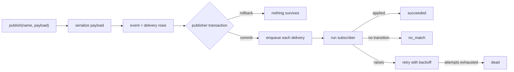

# Design Spec: Durable events

## Status

Draft for engineering review. No implementation has started.

## Purpose in one sentence

Persist every event and deliver it to durable subscribers through ActiveJob so
that deploys, crashes, and handler failures do not silently lose work.

## Why this is needed

Today, `Strata::EventManager.publish` uses
`ActiveSupport::Notifications.instrument`. Subscribers run inline in the same
process, and the event is forgotten afterward.

This creates four important failure modes:

1. A crash or deploy during a handler loses the work permanently.
2. There is no event or delivery history to inspect or replay.
3. A business-process step is saved before its work runs, so a crash can leave
   the case advanced even though the work never happened.
4. Step exceptions are swallowed, which makes failures invisible and would
   prevent ActiveJob retries from working.

## Proposed behavior

Publishing an event will:

1. Serialize the payload.
2. Insert one `strata_events` row in the publisher's database transaction.
3. Insert one `strata_event_deliveries` row for each durable subscriber.
4. Wait for the publisher's outermost transaction to commit.
5. Enqueue one ActiveJob per delivery.
6. Run each handler with retry and record its outcome.



The public method signatures and subscriber input stay the same:

- `publish(event_key, payload = {})`
- `subscribe(event_key, callback)`
- `unsubscribe(subscription)`
- `unsubscribe_all`
- Subscriber input remains `{ name:, payload: }`.

`publish` currently returns `nil`; it will return the persisted
`Strata::Event`. This return-value change is a breaking API change, even though
existing SDK and dummy-app callers do not depend on the current return value.
Host applications must review callers before upgrading.

## Subscriber types

Each subscription takes exactly one delivery path.

| Callback | Delivery | Reason |
| --- | --- | --- |
| A `Method` on a named class or module | Durable ActiveJob delivery | It can be represented by a stable key such as `PassportBusinessProcess.handle_event` and reconstructed in a worker. |
| Anonymous lambda, proc, or other non-addressable callable | Supported only while durability is disabled | A closure cannot be reconstructed safely in another process, so registration raises when durability is enabled. |

SDK business processes already subscribe with a named method, so they become
durable without call-site changes. Host applications must replace lambdas with
named methods before enabling durability.

The durable flag is read when subscriptions are registered. It must be set
before `after_initialize` registrations run and must not be changed at runtime.

## Data model

### `strata_events`

Stores the event name, serialized payload, optional publisher identity, and
publication timestamp.

### `strata_event_deliveries`

Stores one row per `(event, subscriber)` with:

- subscriber key;
- status;
- attempt count;
- `next_attempt_at`;
- `enqueued_at`;
- last error;
- completion time.

Delivery statuses are:

| Status | Meaning |
| --- | --- |
| `pending` | Recorded but not completed. |
| `succeeded` | The subscriber completed and applied work, or returned an unrecognized success value. |
| `failed` | The latest attempt raised. A non-null `next_attempt_at` means another retry is required. |
| `no_match` | The subscriber ran but no transition matched. |
| `dead` | Retries were exhausted or the payload can no longer be deserialized. Operator action is required. |

A unique database index prevents duplicate rows for the same event and
subscriber. The event foreign key uses `ON DELETE CASCADE` so pruning an event
also removes its deliveries. An index covering status, `next_attempt_at`, and
`enqueued_at` supports the stranded-attempt sweeper.

Targets are deliberately not stored on delivery rows. Cases are resolved once,
inside the handler at delivery time. This avoids duplicate routing, supports
start events that create a case, and keeps publishing to one insert per
subscriber with no case lookup.

Each host case table also gains a non-null
`business_process_transition_version` integer defaulting to `0`. It increments
with every step transition and is used only for durable-event concurrency;
unlike Rails' general `lock_version`, it does not change the behavior of
unrelated case updates.

## Payload contract

Payloads use `ActiveJob::Arguments.serialize` and `deserialize` rather than raw
JSON. This preserves symbol keys and converts ActiveRecord objects to GlobalID
references.

Rules:

- Payloads contain identifiers, not record attributes or PII.
- Development and test validate that values are scalars, GlobalID-capable
  records, or collections of those values.
- Production does not run the identifier-only validation, so it cannot reject
  a person's submission for that policy check.
- A payload ActiveJob cannot serialize is a programming error. Publishing
  raises before writing an event row. Because publishing happens in model
  callbacks, this can reject the originating domain write.
- Replaying a GlobalID reads the record's current state, not a historical
  snapshot.
- A GlobalID for a deleted record is terminal: the delivery becomes `dead`
  without retry.

## Delivery guarantees

### At least once, not exactly once

Every durable subscriber receives an event at least once. A job may run more
than once if a worker completes the handler but loses its acknowledgement.

The delivery job locks the delivery row and returns immediately when that row
is terminal (`succeeded`, `no_match`, or `dead`). An explicit operator replay
first resets the delivery to a runnable status.

### Atomic database state

The subscriber call and terminal delivery-status update share a transaction.
The case step and the record that says it was applied therefore commit or roll
back together.

External side effects are not transactional. An HTTP request, payment, or
notice can succeed before the database transaction fails, then run again on
retry. System-process callbacks must be idempotent. Phase 3 also adds a
per-step `retryable: false` option for work that must dead-letter on its first
failure.

### Concurrent events for one case

Every transition uses a conditional update based on both the step and a
monotonic transition version the handler read:

```ruby
Case.where(
  id: case_id,
  business_process_current_step: from_step,
  business_process_transition_version: from_version
).update_all(
  business_process_current_step: to_step,
  business_process_transition_version: from_version + 1
)
```

Only one competing transition can update the expected step. A loser runs no
step side effects and reports `no_match`.

The version must increase on every transition and must never be reset when a
process revisits a step. This preserves the existing DSL's support for cyclic
flows while preventing the A-B-A race in which a stale worker sees the same
step name again.

### Ordering

Neither per-case nor global publication ordering is guaranteed. An event that
arrives before its expected step becomes a visible `no_match` rather than
disappearing silently. The host application team monitors these outcomes and
replays an event when appropriate. Queue-level ordering is deferred unless
production evidence shows that this operational model is insufficient.

## Closing enqueue gaps for initial delivery and retries

The same failure window exists when first publishing an event and when
scheduling a retry: a process can commit the need for an attempt and die before
`perform_later` creates its job. ActiveJob's `retry_on` is not sufficient for
handler failures because its next enqueue is not represented durably in the
delivery row.

Strata therefore owns retry scheduling instead of using `retry_on` for handler
errors. The delivery row is the durable schedule for every attempt:

1. A newly published delivery is `pending`, with `next_attempt_at` set to the
   publication time and `enqueued_at` set to `nil`.
2. If a handler raises, its work rolls back. In a separate transaction, the
   job records the failed attempt and error. When attempts remain, it sets
   `status = failed`, calculates the backoff in `next_attempt_at`, and clears
   `enqueued_at` before committing. When attempts are exhausted or the step is
   not retryable, it records `dead` and clears `next_attempt_at`.
3. Only after that transaction commits does the dispatcher schedule the job:

   ```ruby
   Strata::EventDeliveryJob
     .set(wait_until: delivery.next_attempt_at)
     .perform_later(delivery.id)
   ```

   It stamps `enqueued_at` only after the queue adapter accepts the job.
4. The scheduled sweeper finds `pending` and `failed` deliveries whose
   `next_attempt_at` is due, whose `enqueued_at` is still `nil`, and whose
   recovery grace period has elapsed. It enqueues the missing attempt using
   the same dispatcher.

Terminal outcomes clear `next_attempt_at`; `enqueued_at` remains the timestamp
when the most recent job was accepted by the queue.

This protocol recovers a process death before the initial enqueue and a worker
death after recording `failed` but before scheduling the retry. A delivery with
a non-null `enqueued_at` is left to the durable queue backend, so a merely slow
queue is not amplified.

The remaining enqueue-before-stamp race fails safely: the sweeper may create
one duplicate job, which the delivery status check absorbs.

Hosts must schedule the sweeper every few minutes. Every attempt is enqueued
after its schedule is committed, including when Solid Queue or GoodJob uses
the application's Postgres database. Sidekiq remains supported, and the same
sweeper-backed protocol applies to every backend.

## Handler outcome contract

SDK business-process handlers report whether work happened:

- `transition_to_next_step` returns `:transitioned` or `:no_match`.
- `handle_event` returns `:transitioned` if at least one resolved case moved;
  otherwise it returns `:no_match`.
- Start events return `:transitioned` after creating and starting a case.
- A host subscriber may return `:no_match` to opt into this reporting.
- Any other host return value is treated as success for compatibility.

`no_match` is per `(event, subscriber)`, not per case. An event resolving to
several cases is `succeeded` when at least one case moves.

## Configuration

```ruby
Strata::Events.durable          = false
Strata::Events.queue_name       = :strata_events
Strata::Events.max_attempts     = 5
Strata::Events.stranded_after   = 5.minutes
Strata::Events.retention_period = nil
```

Important defaults and checks:

- Durability is opt-in for at least the first release.
- `max_attempts` is read at delivery time rather than frozen in the job class.
- `stranded_after` is the grace period after `next_attempt_at` before the
  sweeper treats an unstamped initial delivery or retry as stranded.
- Pruning is disabled until a host chooses a retention period.
- Enabling durability with `async`, `inline`, or an inappropriate `test`
  adapter is refused at boot.
- Missing event tables produce one boot-time warning and fall back to today's
  behavior instead of crashing the host.

## Operator interface

No web console is included. Operators use rake tasks and model scopes.

| Task | Purpose |
| --- | --- |
| `strata:events:status[event_id]` | Inspect an event and its deliveries. |
| `strata:events:replay[delivery_id]` | Replay one failed or dead delivery without republishing its event. |
| `strata:events:replay_dead[event_name]` | Replay dead deliveries in bulk. |
| `strata:events:requeue_stranded` | Recover initial deliveries and retries whose committed attempt was never enqueued. |
| `strata:events:prune[days]` | Delete events older than the configured or supplied age. |
| `strata:events:check_payloads[event_name]` | Find incompatible payloads before enabling durability. |

Replay is privileged because it can create tasks, advance cases, send notices,
or call external systems. It remains shell-only. Any future HTTP interface
requires authorization and audit logging.

## Required fixes to existing behavior

These changes are prerequisites, not optional cleanup:

1. Wrap the case step change and step execution in one transaction so failure
   does not leave the case falsely advanced.
2. Make transitions return `:transitioned` or `:no_match`.
3. Preserve symbol keys through serialization.
4. Stop swallowing step exceptions once handlers run in jobs, so retries can
   see failures.

Exception propagation must not land by itself while handlers still run inside
the publisher's transaction. Until durable jobs exist, a publish-boundary
rescue keeps the form or task saved while rolling back the failed case step.

## Delivery plan

### Phase 1: make current transitions safe

- Make step mutation and execution transactional.
- Add the handler outcome contract.
- Add a publish-boundary rescue so a handler failure does not roll back the
  form or task that published the event.

### Phase 2: record events durably

- Add migrations, models, generator, payload serialization, and the durable
  subscriber registry.
- Persist event and delivery rows.
- Keep delivery synchronous and in-process while storage is validated.

This phase can reject an originating write when a host publishes a payload
ActiveJob cannot serialize. Hosts must run the payload preflight first.

### Phase 3: deliver durably

- Add jobs, durable per-attempt retry scheduling, dead-lettering, replay, and
  the stranded-delivery sweeper.
- Add conditional transitions to prevent competing events from both advancing
  the same current step.
- Add `retryable: false` to process steps.
- Let handler exceptions propagate to the delivery job so it can roll back the
  handler transaction, persist the next attempt, and schedule it durably.
- Keep durability off by default until it has field experience.

## Host upgrade checklist

1. Upgrade the gem; behavior remains unchanged because durability defaults off.
2. Run `rails generate strata:events` and migrate.
3. Run `rake strata:events:check_payloads` and fix incompatible publishers.
4. Replace anonymous lambda, proc, and callable-object subscribers with named
   class or module methods.
5. Add the generated monotonic transition-version field to existing host case
   tables.
6. Audit every external system callback for idempotency; mark unsafe steps
   `retryable: false` when appropriate.
7. Configure a durable ActiveJob backend: Solid Queue, GoodJob, or Sidekiq.
8. Schedule `strata:events:requeue_stranded` every few minutes.
9. Set `Strata::Events.durable = true` before subscriptions register.
10. Update synchronous-delivery tests using `Strata::Events::TestHelpers` and
   `perform_enqueued_jobs`.

## Acceptance scenarios

### Event survives a committed publish

- **Given** durability is enabled and a durable subscriber is registered
- **When** a publisher transaction commits
- **Then** the event and delivery rows exist and the subscriber is eventually
  invoked.

### Rolled-back publish produces no durable work

- **Given** an event is published inside a transaction
- **When** the transaction rolls back
- **Then** no event row, delivery row, or durable delivery survives.

### Handler failure is retried and becomes visible

- **Given** a handler raises on every attempt
- **When** it reaches `max_attempts`
- **Then** its database changes are rolled back and the delivery becomes `dead`
  with the error and attempt count recorded.

### Duplicate execution does not reapply completed work

- **Given** a delivery already succeeded
- **When** the same job runs again
- **Then** it returns without advancing the case or repeating step work.

### Competing transitions do not both run

- **Given** two events are valid from the same current step
- **When** their jobs run concurrently
- **Then** one transition applies, only that transition's side effects run,
  and the other delivery records `no_match`.

- **Given** a stale job read step A at transition version 1
- **When** the workflow advances from A to B and later returns to A at version 3
- **Then** the stale job's conditional update fails and it runs no side effects.

### Lost initial or retry enqueue is recovered without amplifying a slow queue

- **Given** a pending delivery is due, its recovery grace period has elapsed,
  and it has never been stamped `enqueued_at`
- **When** the sweeper runs
- **Then** it enqueues that delivery.

- **Given** a handler failure was recorded with a due `next_attempt_at` and its
  recovery grace period has elapsed
- **And** the worker died before enqueueing the retry, leaving `enqueued_at`
  null
- **When** the sweeper runs
- **Then** it enqueues the missing retry.

- **Given** a pending or failed delivery was already enqueued
- **When** the sweeper runs
- **Then** it does not enqueue a duplicate merely because the queue is slow.

### Payload compatibility is preserved

- **Given** a payload contains symbol keys, nested supported values, and a
  GlobalID-capable record
- **When** it is serialized and deserialized
- **Then** symbol access still works and the record reference resolves.

### Deleted GlobalID does not retry forever

- **Given** a payload references a record that was deleted before delivery
- **When** the job deserializes it
- **Then** the delivery becomes `dead` without another retry.

### Pruning removes complete event history safely

- **Given** an old event still has delivery rows
- **When** the prune task deletes the event
- **Then** its delivery rows are deleted by the foreign-key cascade.

### Incomplete host setup fails safely

- **Given** the migration has not run
- **When** the host boots
- **Then** it warns once and uses today's synchronous behavior.

- **Given** durability is enabled with a non-durable queue adapter
- **When** the host boots
- **Then** boot fails with a clear configuration error.

- **Given** durability is enabled
- **When** a caller registers an anonymous lambda, proc, or callable object
- **Then** registration fails with a clear message explaining how to use a
  named method.

## Resolved decisions and remaining risks

Resolved:

1. **Retention is host-configured.** The SDK mandates no retention period.
   `Strata::Events.retention_period` defaults to `nil`, and each host must set
   it according to its own policy before enabling pruning.
2. **Database encryption at rest is the SDK baseline.** Payloads are limited
   to identifiers, GlobalID references, and timestamps. Application-level
   payload encryption is optional and remains a host responsibility when its
   policy requires stronger protection.
3. **Durability uses a two-release rollout.**
   `Strata::Events.durable` defaults to `false` in the first release and
   defaults to `true` in the following release.
4. **Each host application team owns `no_match` monitoring.** Host teams must
   watch their production counts, define alert thresholds, and investigate
   unexpected increases.
5. **Durable mode rejects anonymous subscribers.** Lambdas, procs, and other
   non-addressable callables continue to work only while durability is
   disabled. When durability is enabled, registration fails with a migration
   message because these callbacks cannot be persisted, retried, replayed, or
   reconstructed in a worker.
6. **Remove `strata:events:publish_case_event`.** No host application uses the
   task, and its current payload does not drive a transition. Delete it rather
   than porting ineffective behavior to durable delivery.
7. **Always enqueue every attempt after commit.** Every supported queue backend
   follows the same protocol: commit the initial delivery or next retry time,
   then enqueue that attempt. The required sweeper recovers a process failure
   between those operations for both initial delivery and retries.
   Same-database queues do not use a separate in-transaction optimization.
8. **Publication ordering is not guaranteed.** The initial design does not use
   queue-level per-case concurrency. Conditional database updates prevent two
   events from winning the same transition; an event that arrives too early is
   recorded as `no_match` and may be replayed by the host application team.
   Add sequencing only if production evidence shows it is necessary.
9. **Cyclic workflows remain supported.** Add a monotonic transition-version
   field to case state and include it in every conditional transition. This
   prevents a stale worker from succeeding after a workflow moves away from
   and then returns to the same named step. The migration generator must cover
   new case tables, and existing hosts must add the field before enabling
   durability.

## Explicitly out of scope

- Durable or cross-process delivery for anonymous lambda subscribers.
- An operator web console.
- Per-case and global publication ordering.
- New SDK event names or payload shapes.
- Automatically making existing external callbacks idempotent.
